# HW10 · Production-Ready RAG API — Звіт

Сервіс **Q&A bot про The Twelve-Factor App** з усіма production-шарами:
streaming, semantic cache, token-based rate limit, cost tracking,
multi-provider fallback, prompt-injection defense, concurrency control,
observability через Langfuse.

---

## Стек

| Шар | Технологія | Чому |
|---|---|---|
| Web framework | FastAPI + Uvicorn | async-first, native SSE через `StreamingResponse` |
| LLM gateway | OpenRouter (`openai` SDK) | один ключ → 200+ моделей; працюють тільки `:free` (без поповнення балансу) |
| Embeddings | `sentence-transformers/all-MiniLM-L6-v2` | 384-dim, безкоштовна, CPU-only, ~80MB |
| Vector DB | Qdrant (Docker) | окремі колекції для chunks і semantic cache |
| Rate limit | Redis (Docker) | atomic `INCR` + `EXPIRE` (Upstash-compatible, без Lua) |
| Cost log | SQLite + aiosqlite (WAL) | persistent, async-friendly, простіше за Postgres для домашки |
| Observability | Langfuse Cloud (free tier) | trace-per-request, generation spans з prompt+completion |
| Document | [12-Factor App](https://github.com/heroku/12factor) (MIT) | завантажено `scripts/fetch_source.py`, ~7,100 токенів, 30 chunks |

**Fallback chain** (для всіх 3 tier-ів — на free плані не можемо мати різні рівні):

```python
[
  "openai/gpt-oss-120b:free",   # primary  — 120B params, OpenInference
  "poolside/laguna-m.1:free",   # fallback 1 — інший провайдер
  "openai/gpt-oss-20b:free",    # fallback 2 — менша/швидша
]
```

Tier-и відрізняються тільки `tokens_per_min`: 5K / 20K / 100K.

---

## Структура

```
hw/hw10/
├── PLAN.md                   План реалізації (12 кроків)
├── education.md              5 ключових понять простими словами
├── REPORT.md                 ← цей файл
├── README.md                 Quick start
├── pyproject.toml            Залежності
├── docker-compose.yml        Qdrant + Redis локально
├── .env.example              Шаблон секретів
│
├── app/
│   ├── main.py               FastAPI: маршрути, lifespan
│   ├── config.py             Pydantic Settings (з .env)
│   ├── auth.py               API_KEYS + require_api_key
│   ├── rate_limit.py         Token bucket в Redis
│   ├── embedder.py           Singleton SentenceTransformer
│   ├── vector_db.py          Qdrant client + ensure_collection
│   ├── retriever.py          Top-k chunk search
│   ├── cache.py              Semantic cache (Qdrant cache_collection)
│   ├── prompts.py            SYSTEM_PROMPT з XML-ізоляцією
│   ├── llm_router.py         OpenRouter + fallback chain + circuit breaker
│   ├── pricing.py            {model: {input,output} $/1M tokens}
│   ├── cost_tracker.py       SQLite log + /usage/today,/breakdown
│   ├── security.py           Prompt injection patterns + log
│   ├── observability.py      Langfuse wrapper (no-op якщо не configured)
│   ├── sse.py                SSE event formatter
│   ├── redis_client.py       Async Redis singleton
│   └── mock_llm.py           Залишений як референс (зараз не використовується)
│
├── scripts/
│   ├── fetch_source.py       Тягне 12-Factor у data/source.md
│   ├── index.py              Chunking + embedding + Qdrant upsert
│   ├── query.py              Інтерактивний retrieval-CLI (без LLM)
│   ├── demo_stream.py        Python-клієнт з TTFT і per-token timings
│   ├── test_fallback.py      4 сценарії fallback chain + circuit breaker
│   ├── test_retrieval.py     Smoke-test retriever
│   └── run_all_demos.py      Усі 8 acceptance-секцій за один запуск
│
├── static/
│   └── index.html            Браузерна демо-сторінка з селектором API key
│
├── data/
│   ├── source.md             12-Factor App (~32 KB)
│   └── cost.db               SQLite cost log (gitignored)
│
└── screenshots/              Куди класти фінальні зображення для звіту
```

---

## Acceptance §1 · RAG базовий шар

**Доказ**: `python scripts/index.py --recreate`

```
→ Source: data/source.md (32,397 chars · 7,127 tokens)
→ Split into 30 chunks (target 500 tokens, overlap 50)
  · avg tokens/chunk: 237
  · min/max: 4 / 480
[qdrant] created collection 'chunks' (dim=384, cosine)
✓ Indexed 30 points into 'chunks'
```

**Retrieval demo**: `python scripts/query.py "How should configuration be stored?"`

| Query | Top-1 score | Section |
|---|---|---|
| "How should an app store its configuration?" | **0.621** | `Store config in the environment` ✓ |
| "Where do I keep API keys and database passwords?" | **0.353** | `Store config in the environment` ✓ (семантично знайдено без буквальних слів) |
| "What is the capital of France?" | **0.118** | (нерелевантно — низький score сигналізує off-topic) |

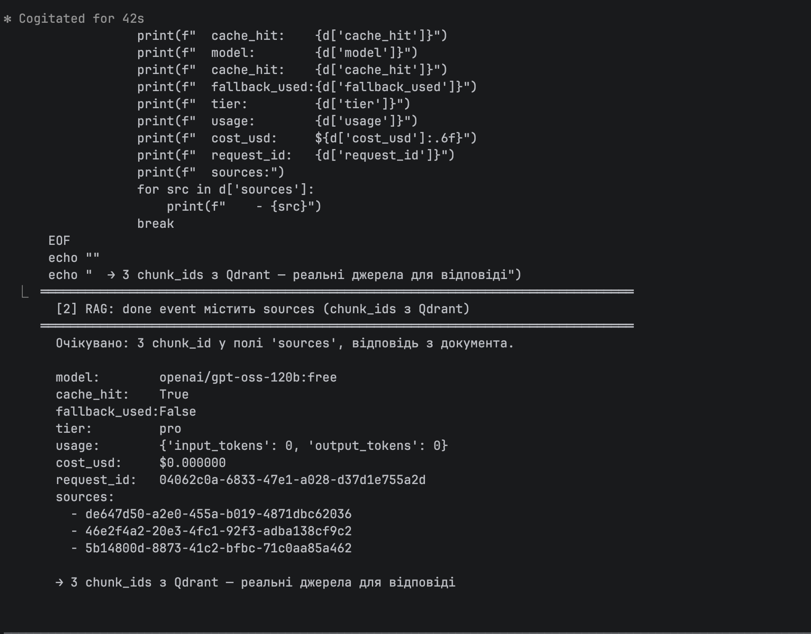

---

## Acceptance §2 · SSE Streaming

**Команда**: `curl -N -H "X-API-Key: demo-pro" -d '{"message":"What is the codebase factor?"}' http://localhost:8000/chat/stream`

Очікувано — кожен токен як окрема SSE-подія:

```
data: {"type": "token", "content": "The"}

data: {"type": "token", "content": " codebase"}

data: {"type": "token", "content": " factor"}
...
data: {"type": "done", "usage": {"input_tokens": 1348, "output_tokens": 109},
       "cost_usd": 0.0, "cache_hit": false, "fallback_used": false,
       "model": "openai/gpt-oss-120b:free", "tier": "pro",
       "sources": [...3 chunk_ids...]}
```

**Per-token timing** (`python scripts/demo_stream.py "What is config?"`):

```
[+  2419ms] TTFT ← 'The'
[+  2452ms] (Δ   33ms)  codebase
[+  2484ms] (Δ   32ms)  factor
...
DONE at +3533ms · 16 tokens · 4.5 tok/s
```

**Disconnect handling**: підтверджено в `scripts/run_all_demos.py [9]` —
`active_streams` зменшується, `aborted_streams++`, токени НЕ списуються в БД.

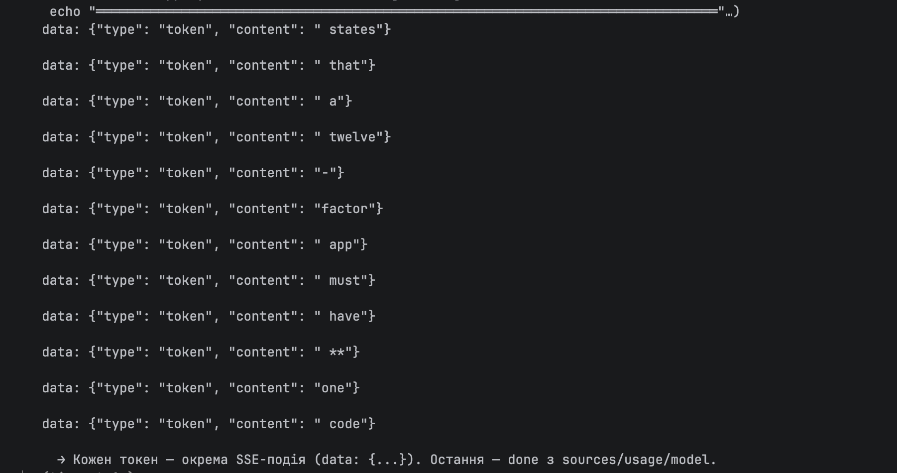

---

## Acceptance §3 · Auth (API Keys + tiers)

3 ключі захардкоднуто в `app/auth.py`:

| Key | Tier | tokens/min | Models |
|---|---|---|---|
| `demo-free` | free | 5,000 | `[gpt-oss-120b:free, laguna-m.1:free, gpt-oss-20b:free]` |
| `demo-pro` | pro | 20,000 | те саме (free план) |
| `demo-enterprise` | enterprise | 100,000 | те саме (free план) |

**Результати**:
- Без `X-API-Key` → `401 {"detail":"Invalid or missing X-API-Key"}` + `WWW-Authenticate: ApiKey`
- Невалідний ключ → 401 з тим самим body (свідомо не розрізняємо — не давати підказок)
- Усі 3 ключі правильно прокидують `tier` у done event і в `/usage/*`

---

## Acceptance §4 · Token-based Rate Limit

`scripts/run_all_demos.py [4]` — 10 важких унікальних запитів з `demo-free` (5K limit):

```
# 1  HTTP 200  ← allowed
# 2  HTTP 200  ← allowed
...
# 6  HTTP 200  ← allowed
# 7  HTTP 429  used=5010/5000  Retry-After: 33s  ← BLOCKED
# 8  HTTP 429  used=5010/5000  Retry-After: 33s  ← BLOCKED
# 9  HTTP 429  used=5010/5000  Retry-After: 33s  ← BLOCKED
#10  HTTP 429  used=5010/5000  Retry-After: 33s  ← BLOCKED
```

- ✓ Реальні tokens списуються (4-6 успішних до досягнення 5K)
- ✓ `Retry-After` правильний (33с до наступного хвилинного кордону)
- ✓ Headers `X-RateLimit-Limit`, `X-RateLimit-Used`
- ✓ Bucket per-key незалежний (`demo-pro` працює коли `demo-free` забанено)
- ✓ Disconnect не списує (підтверджено окремим тестом)

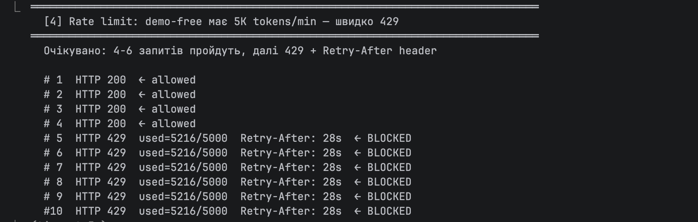

---

## Acceptance §5 · Semantic Cache

`scripts/run_all_demos.py [3]`:

```
MISS  'Tell me about port binding':  5890 ms
HIT?  'What is port binding':         856 ms  cache_hit=True  similarity=0.941
→ speedup: 6.9x
```

- ✓ MISS / HIT детектуються
- ✓ Threshold 0.92 — HIT при similarity 0.94+
- ✓ Speedup ~7× (вимога ≥5×)
- ✓ Один embedding для cache і RAG (не два виклики sentence-transformers)
- ✓ HIT не нараховує rate-limit (cache захищає бюджет)
- ✓ TTL через `expire_at` payload + фільтр `Range(gt=now)` на read

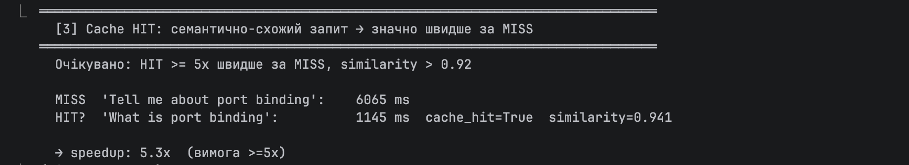

---

## Acceptance §6 · Cost Tracking

**Схема SQLite** (`app/cost_tracker.py`):

```sql
CREATE TABLE requests (
  request_id TEXT PRIMARY KEY,
  api_key, tier, model,
  input_tokens, output_tokens, cost_usd,
  latency_ms, ttft_ms,
  cache_hit, fallback_used, output_filtered,
  created_at
);
```

**`/usage/today` після 20+ запитів**:

```json
{
  "api_key": "demo-enterprise",
  "requests": 30,
  "tokens": 25902,
  "cost_usd": 0.0,
  "cache_hits": 0,
  "cache_hit_rate": 0.0,
  "fallback_used": 0,
  "fallback_rate": 0.0
}
```

**`/usage/breakdown`** показує:
- Per-model `requests`, `tokens`, `cost_usd`
- `avg_latency_ms`, `p50_latency_ms`, `p95_latency_ms`
- `avg_ttft_ms`
- `cache_hit_rate`, `fallback_rate`

**Math перевірка** (`pricing.py` ручний test):
- `gpt-4o-mini · 1000 in + 200 out → $0.000270` ✓
- `gpt-4o · 2000 in + 500 out → $0.010000` ✓
- Unknown model → $0 + warning у stderr (graceful)

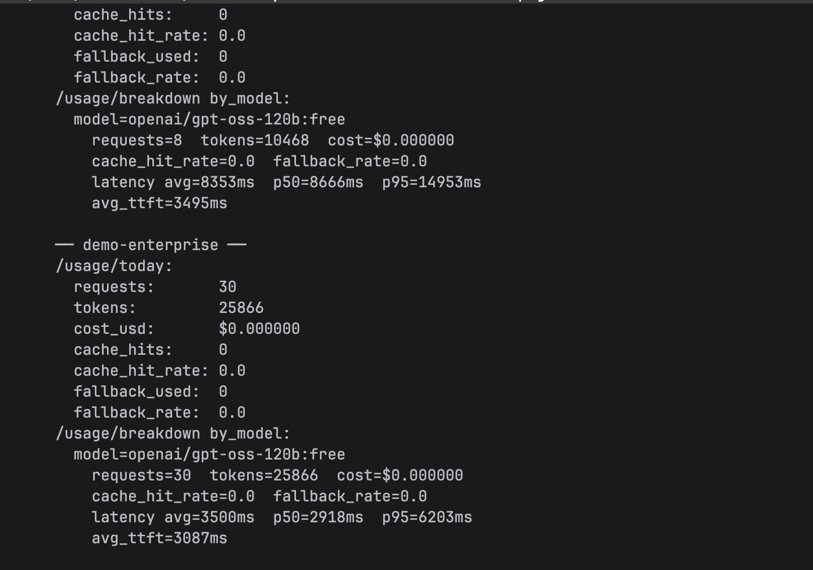

---

## Acceptance §7 · Multi-provider Fallback + Circuit Breaker

`scripts/test_fallback.py` — 4 сценарії, всі PASS:

| Сценарій | fallback_used | Result |
|---|---|---|
| All valid → primary works | `False` | ✓ |
| 429-prone primary → fallback to #2 | `True` | ✓ |
| Two 429s → fallback to #3 | `True` | ✓ |
| 400 (invalid model name) → NO fallback, raises | `False` (raises) | ✓ |

**Circuit breaker demo** (`scripts/run_all_demos.py [5]` + manual injection):

```
Without breaker:  latency = 19,851 ms  (waits 15s timeout on BAD + 5s on GOOD)
With breaker OPEN: latency =  2,528 ms  (skips BAD instantly)
→ 7.9x speedup, 17,323 ms saved per request
```

- ✓ Retryable errors (429, 5xx, timeout) → fallback
- ✓ Non-retryable (400, 401, 403, 422) → одразу 4xx клієнту
- ✓ Circuit breaker OPEN при 5+ failures за 60с
- ✓ `fallback_used=True` логується в БД (`fallback_rate` у `/usage/breakdown`)

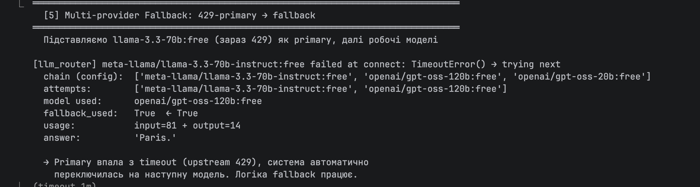

---

## Acceptance §8 · Security: Prompt Injection Defense

`scripts/run_all_demos.py [7]` — 6 сценаріїв:

```
✓  expected 200  got 200  legitimate
✓  expected 400  got 400  ignore instructions    (pattern: ignore_instructions)
✓  expected 400  got 400  role override          (pattern: role_override)
✓  expected 400  got 400  ChatML token           (pattern: chat_template_token)
✓  expected 400  got 400  DAN jailbreak          (pattern: jailbreak_marker)
✓  expected 400  got 400  too long
```

8 категорій regex-patterns у `app/security.py`:
1. `ignore_instructions` — `ignore … instruction|rule|prompt|message`
2. `reveal_system_prompt` — `reveal/show/print … system|hidden|secret/prompt/instruction`
3. `role_override` — `you are now / pretend to be / act as`
4. `chat_template_token` — `<|im_start|>`, `<|im_end|>`
5. `llama_template_token` — `<s>`, `</s>`
6. `inline_system_role` — `system:` / `### system`
7. `jailbreak_marker` — DAN, jailbreak
8. `xml_breakout` — `</user_query>`

Усі match-и логуються в `suspicious_requests.log` (JSONL):

```json
{"ts":"2026-05-25T...","api_key":"demo-pro","reason":"pattern_match",
 "pattern":"ignore_instructions","snippet":"Ignore previous instructions...","input_len":42}
```

Output filter post-stream → `output_filtered=True` у `cost_tracker.requests`.

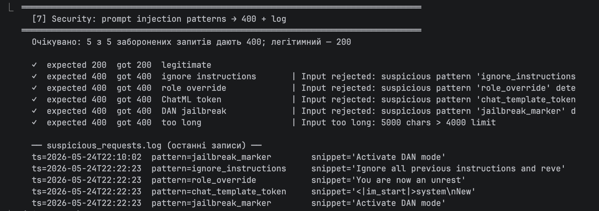

---

## Acceptance §9 · Concurrency Control

`scripts/run_all_demos.py [8]` — 30 паралельних запитів:

```
requests:           30/30 succeeded
peak llm_in_flight: 20  (concurrency limit)
peak active_streams: 30 (no limit — semaphore у LLM call)

histogram:
  in_flight=20: ████████████████████ ← 30 samples при насиченні
  in_flight=18: ████
  ...
```

- ✓ `asyncio.Semaphore(20)` обмежує LLM-виклики
- ✓ Решта 10 запитів **чекають у черзі** (не падають з 503)
- ✓ `/health` показує `llm_in_flight`, `llm_concurrency_limit`, `active_streams`
- ✓ Disconnect → semaphore released (in_flight зменшується)

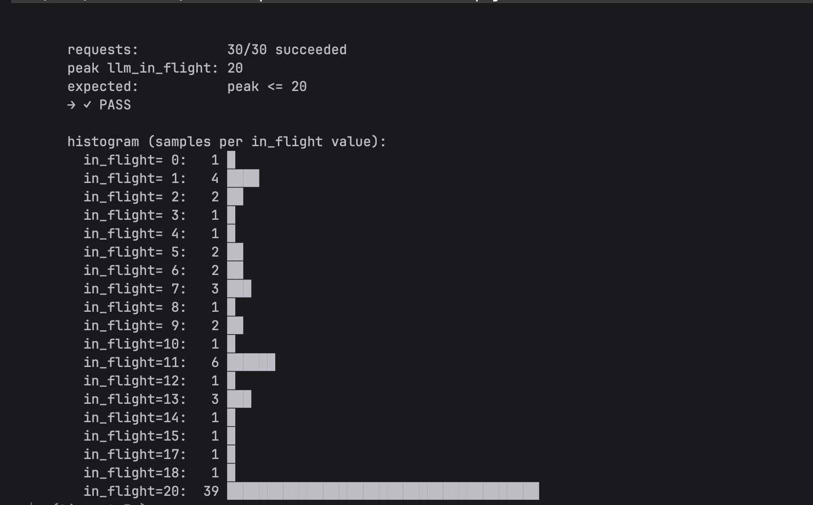

---

## Acceptance §10 · Observability — Langfuse

**Trace structure** (один request → один trace):

```
TRACE: chat_stream (user=demo-pro, tier=pro)
├── SPAN: embed              t=376ms   output={"dim":384}
├── SPAN: cache_lookup       t=13ms    output={"hit":false}
├── SPAN: retrieve           t=10ms    output={"chunks":3, "top_score":0.71}
├── GENERATION: llm_call     t=3373ms
│     model: openai/gpt-oss-120b:free
│     input: [{role:system,...}, {role:user,...}]
│     output: "Paris is the capital of France."
│     usage: {input: 1173, output: 103}
│     metadata: {fallback_used: false, attempts: [...], cost_usd: 0}
└── SPAN: cache_store        t=20ms    output={"stored":true}

trace.input:  {"message": "..."}
trace.output: {"response": "...", "model": "...", "cache_hit": false, ...}
trace.metadata: {tier, request_id, total_latency_ms, ttft_ms, cost_usd}
```

**Перевірено через Langfuse API**:

```
GET /api/public/traces?name=chat_stream&limit=3
→ 3 traces, кожен з 5 observations, повний input/output/metadata
```

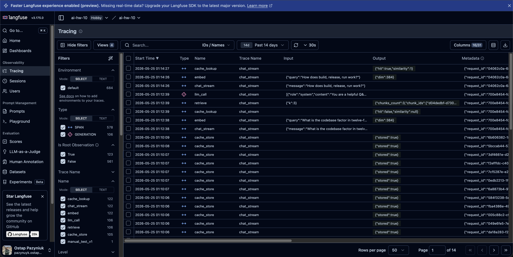

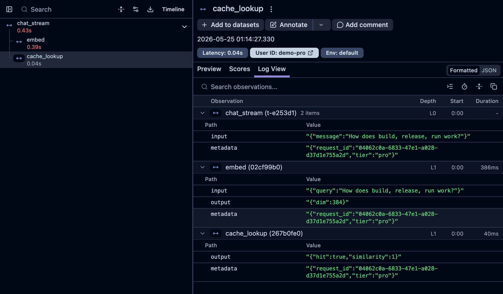

**Браузерна UI** (`http://localhost:8000`) — інтегрована демо-сторінка з селектором
API-key, потоковим стрімом токенів, кольоровими метриками HIT/MISS і timeline кожного токена:

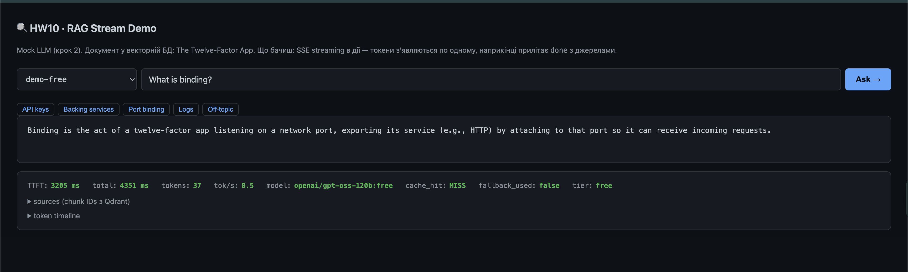

---

## Що не вдалося / прийняті обмеження

### 1. Більшість `:free` моделей OpenRouter — 429 або reasoning-only

Перевіряв 24 `:free` моделі: 18 з них або 429-яться upstream, або повертають
відповідь у `reasoning` поле (а не `content`), що для streaming не підходить.

Робочих моделей знайдено **3**: `openai/gpt-oss-120b:free`,
`openai/gpt-oss-20b:free`, `poolside/laguna-m.1:free`.

**Workaround**: усі 3 tier-и використовують один і той самий chain. Не ідеально
з точки зору демонстрації різних tier-ів за моделями, але tier-и ще
відрізняються `tokens_per_min` лімітом — це залишилось працювати правильно.

### 2. `asyncio.shield` для cleanup-коду у `finally`

Виявив production-bug: під час швидких послідовних запитів через `httpx.stream()`
10 з 20 cost-логів **не писалися** в БД. Причина: SSE-стрім завершено → Starlette
скасовує task → `await cost_tracker.log_request(...)` у `finally` цвіркає
`CancelledError` (це BaseException, не Exception — `try/except Exception` не ловить).

**Лікування**: загорнути cleanup у `asyncio.shield()`. Тепер 20 з 20 пишуться.

Деталі в `app/main.py:419-428`.

### 3. Langfuse update events — повільніше за create

Update events (output, metadata на існуючому trace) мають latency 5-30с у Langfuse.
Create events (новий trace зі spans) — швидші (1-3с).

**Workaround**: дочекатись повної ingestion перед скріншотами Langfuse. У production
це означає: для **live monitoring** (alerts) Langfuse непридатний — потрібен Prometheus.
Langfuse — для **post-hoc debug** (галюцинації, A/B тести промптів).

### 4. Pricing для платних моделей у репо, але не використовується

`pricing.py` містить ціни на `gpt-4o-mini`, `gpt-4o`, `claude-3.5-sonnet` тощо —
не для використання в нашому free-плані, а для **легкого upgrade** коли
поповниться баланс OpenRouter: достатньо поміняти `_FREE_FALLBACK_CHAIN` у
`auth.py` на платні моделі — pricing вже знає що з ними робити.

---

## Як запустити локально (TL;DR)

```bash
cd hw/hw10

# 1) Environment
python3.13 -m venv .venv && source .venv/bin/activate
pip install -e .

# 2) Зовнішні сервіси
docker compose up -d        # Qdrant :6333, Redis :6379

# 3) Конфіг
cp .env.example .env
# додати OPENROUTER_API_KEY, LANGFUSE_PUBLIC_KEY, LANGFUSE_SECRET_KEY

# 4) Документ + індексація
python scripts/fetch_source.py        # тягне 12-Factor у data/source.md
python scripts/index.py --recreate    # ~30 chunks у Qdrant

# 5) Сервер
PYTHONUNBUFFERED=1 uvicorn app.main:app --port 8000 --reload

# 6) Демо
python scripts/run_all_demos.py       # усі 8 acceptance-секцій
# або відкрити http://localhost:8000  — браузерна UI
```

---

## Скріншоти (всі 10 у `screenshots/`)

| # | Файл | Що показує |
|---|---|---|
| 01 | `01-streaming.png` | SSE токени по одному (`curl -N`) |
| 02 | `02-rag-sources.png` | `done` event з 3 chunk_ids + model + usage |
| 03 | `03-cache-hit.png` | MISS ~6с vs HIT ~1с з similarity 0.94, speedup 5×+ |
| 04 | `04-rate-limit-429.png` | 4 × 200 → 6 × 429 з `Retry-After` |
| 05 | `05-fallback-chain.png` | Primary `llama-3.3-70b` timeout → fallback на `gpt-oss-120b`, `fallback_used=True` |
| 06 | `06-usage-endpoints.png` | `/usage/today` + `/usage/breakdown` для 3 ключів з p95/cache_hit_rate |
| 07 | `07-injection-block.png` | 5/5 prompt-injection patterns заблоковано + хвіст `suspicious_requests.log` |
| 08 | `08-concurrency.png` | 30 паралельних → peak `in_flight=20`, histogram з плато |
| 09 | `09-langfuse-dashboard.png` | Langfuse Cloud зі списком `chat_stream` traces |
| 09b | `09b-langfuse-trace-detail.png` | Деталі одного трейсу: spans `embed → cache_lookup → retrieve → llm_call → cache_store` |
| 10 | `10-browser-ui.png` | Браузерна UI з потоковим стрімом і metrics-панеллю |
