# HW2: Data Engineering for AI — Звіт

## Завдання 1: Ipynb — Локальна робота з документами

### Результат: 115/115 балів (100%)

```
ЗАВДАННЯ 1: Визначення кодування
  [PASS] BOM виявлено (+4)
  [PASS] BOM прибрано з тексту (+4)
  [PASS] CP1251 декодовано без кракозябрів (+3)
  [PASS] Кодування визначено (+3)
  [PASS] Latin-1 декодовано (+3)
  [PASS] Кодування визначено (+3)

ЗАВДАННЯ 2: Визначення типу файлу (magic bytes)
  [PASS] HTML-as-PDF: mismatch виявлено (+2)
  [PASS] HTML-as-PDF: detected=html (+2)
  [PASS] PDF-as-HTML: mismatch виявлено (+2)
  [PASS] PDF-as-HTML: detected=pdf (+2)
  [PASS] Empty file: issue виявлено (+2)
  [PASS] Empty file: detected=None (+2)
  [PASS] Binary garbage: не впав, повернув результат (+4)
  [PASS] Normal xlsx: no mismatch (+4)

ЗАВДАННЯ 3: Витягування тексту з брудного HTML
  [PASS] Malformed: текст витягнуто (+3)
  [PASS] Malformed: є 'Revenue' (+2)
  [PASS] Malformed: немає style атрибутів (+3)
  [PASS] Boilerplate: текст витягнуто (+2)
  [PASS] Boilerplate: немає script/analytics (+3)
  [PASS] Boilerplate: useful_ratio < 50% (+3)
  [PASS] Multilingual: є Ukrainian (+2)
  [PASS] Multilingual: є Japanese (+2)

ЗАВДАННЯ 4: Safe parser
  [PASS] Empty file → error (+2)
  [PASS] Empty file → type=empty (+2)
  [PASS] Wrong ext → error (+2)
  [PASS] Wrong ext → type=type_mismatch (+2)
  [PASS] Binary garbage → не впав (+2)
  [PASS] Binary garbage → error status (+2)
  [PASS] Normal HTML → ok (+2)
  [PASS] Normal HTML → є текст (+2)
  [PASS] Жоден файл не крашить функцію (crashed=0) (+4)

ЗАВДАННЯ 5: Витягування таблиць з PDF
  [PASS] Повертає list (+2)
  [PASS] Знайдено 2 таблиці (+3)
  [PASS] Таблиця 1: рядки — словники (+2)
  [PASS] Таблиця 1: є ключ 'Region' (+2)
  [PASS] Таблиця 1: 5 рядків даних (без заголовка) (+2)
  [PASS] Таблиця 1: North America Q1 = 1,200,000 (+3)
  [PASS] Таблиця 2: є ключ 'Product' (+2)
  [PASS] Таблиця 2: 4 рядки даних (+2)
  [PASS] Таблиця 2: Enterprise Platform revenue (+2)

ЗАВДАННЯ 6: Chunking великого документа
  [PASS] Повертає list (+2)
  [PASS] Чанків > 1 (+2)
  [PASS] Кожен чанк — рядок (+2)
  [PASS] Чанки <= chunk_size (+3)
  [PASS] chunk_size=256 дає більше чанків ніж 1024 (+3)
  [PASS] overlap=200 дає більше чанків ніж overlap=0 (+3)

РЕЗУЛЬТАТ: 115/115 балів (100%)
```

### Реалізовані функції

**1. `detect_and_read()`** — визначення кодування файлу через `charset_normalizer`. Перевіряє наявність BOM (`\xef\xbb\xbf`), видаляє його. Визначає кодування через статистичний аналіз байтів (`from_bytes().best()`).

**2. `detect_file_type()`** — визначення реального типу файлу через magic bytes (`filetype.guess()`). Для HTML (немає magic bytes) — ручна перевірка перших 512 байт на `<html` / `<!doctype`. Порівнює з розширенням файлу.

**3. `extract_clean_text()`** — витягування тексту з HTML через BeautifulSoup. Видаляє шумові теги (script, style, nav, header, footer, aside) через `decompose()`, витягує чистий текст через `get_text()`.

**4. `safe_parse()`** — безпечна обгортка над `unstructured.partition`. Перевіряє файл на порожність і mismatch типу перед парсингом. Ловить exceptions, класифікує помилки (empty, type_mismatch, corrupted).

**5. `extract_tables_from_pdf()`** — витягування таблиць з PDF через `pdfplumber`. Конвертує raw таблиці в список словників (headers = ключі). Знайшов 2 таблиці: revenue by region (5 рядків) та revenue by product (4 рядки).

**6. `chunk_text()`** — розбиття тексту на чанки через `RecursiveCharacterTextSplitter`. Приймає `chunk_size` та `chunk_overlap` параметри.

---

## Завдання 2: AWS Pipeline — PDF Ingestion

### Архітектура

```
PDF (pypdf) --> S3 (uploads/) --> SQS --> Lambda --> S3 (processed/)
```

Pipeline автоматично обробляє PDF-документи: при завантаженні PDF у S3 bucket тригериться SQS повідомлення, Lambda читає PDF, витягує текст через pypdf і зберігає результат (.txt) назад у S3.

---

### Крок 1: S3 Bucket

Створено bucket `pdf-ingestion-ostap-947566393472-eu-north-1-an` в регіоні `eu-north-1` з двома prefix: `uploads/` (вхідні PDF) та `processed/` (витягнутий текст).

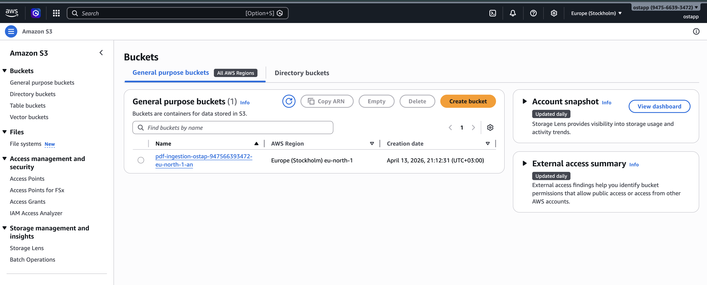

Завантажено тестовий PDF (`financial_report_table.pdf`) у `uploads/`:

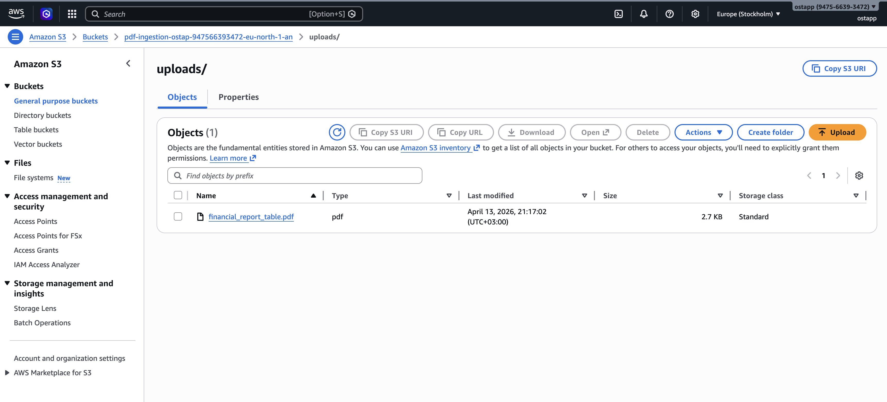

---

### Крок 2: SQS Queue

Створено Standard Queue `pdf-processing-queue`. Налаштовано Access Policy, яка дозволяє S3 bucket надсилати повідомлення в чергу при появі нового файлу.

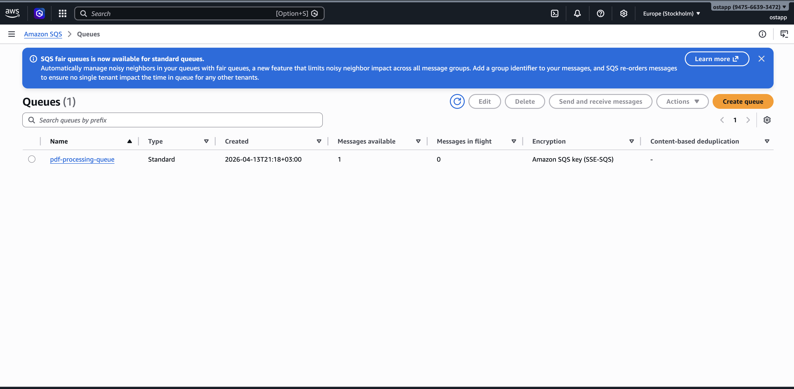

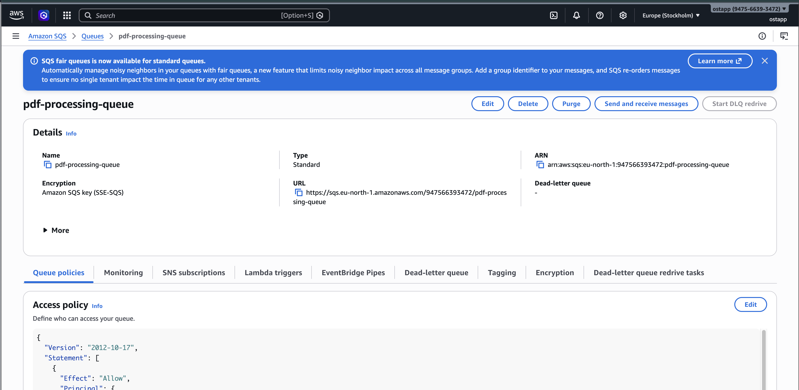

---

### Крок 3: S3 Event Notification

На S3 bucket налаштовано Event Notification `pdf-upload-trigger`:
- Event: `s3:ObjectCreated:*`
- Prefix: `uploads/`
- Suffix: `.pdf`
- Destination: SQS `pdf-processing-queue`

При upload будь-якого `.pdf` файлу в `uploads/` — SQS отримує повідомлення з метаданими файлу.

---

### Крок 4: Lambda Function

Створено функцію `pdf-text-extractor` (Python 3.12, timeout 30s):

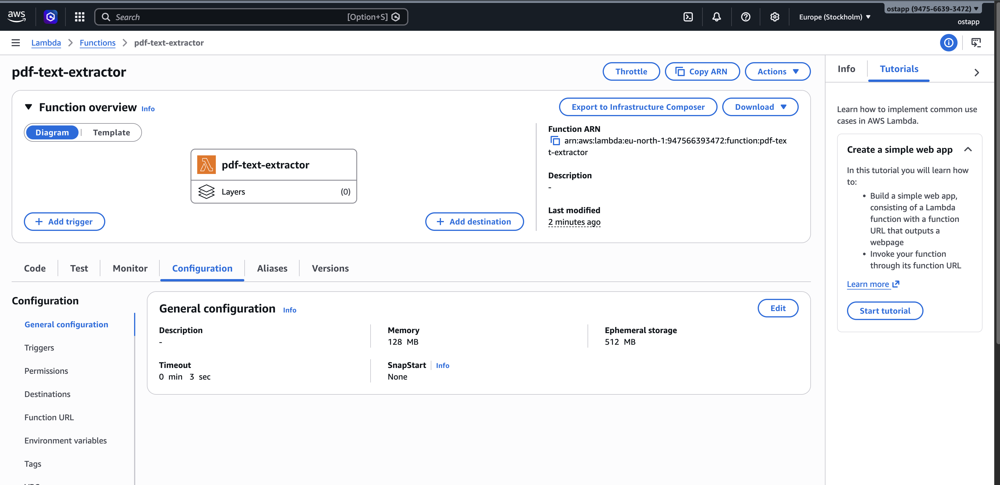

Код функції — читає PDF з S3, витягує текст через pypdf, зберігає .txt в `processed/`:

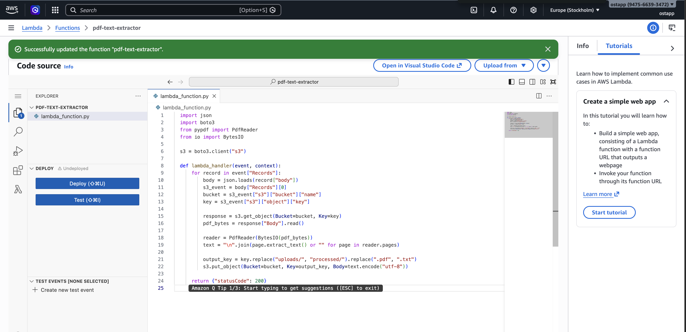

```python
import json
import boto3
from pypdf import PdfReader
from io import BytesIO

s3 = boto3.client("s3")

def lambda_handler(event, context):
    for record in event["Records"]:
        body = json.loads(record["body"])
        s3_event = body["Records"][0]
        bucket = s3_event["s3"]["bucket"]["name"]
        key = s3_event["s3"]["object"]["key"]

        response = s3.get_object(Bucket=bucket, Key=key)
        pdf_bytes = response["Body"].read()

        reader = PdfReader(BytesIO(pdf_bytes))
        text = "\n".join(page.extract_text() or "" for page in reader.pages)

        output_key = key.replace("uploads/", "processed/").replace(".pdf", ".txt")
        s3.put_object(Bucket=bucket, Key=output_key, Body=text.encode("utf-8"))

    return {"statusCode": 200}
```

---

### Крок 5: Lambda Layer (pypdf)

pypdf не входить в Lambda runtime — створено Lambda Layer з пакетом:

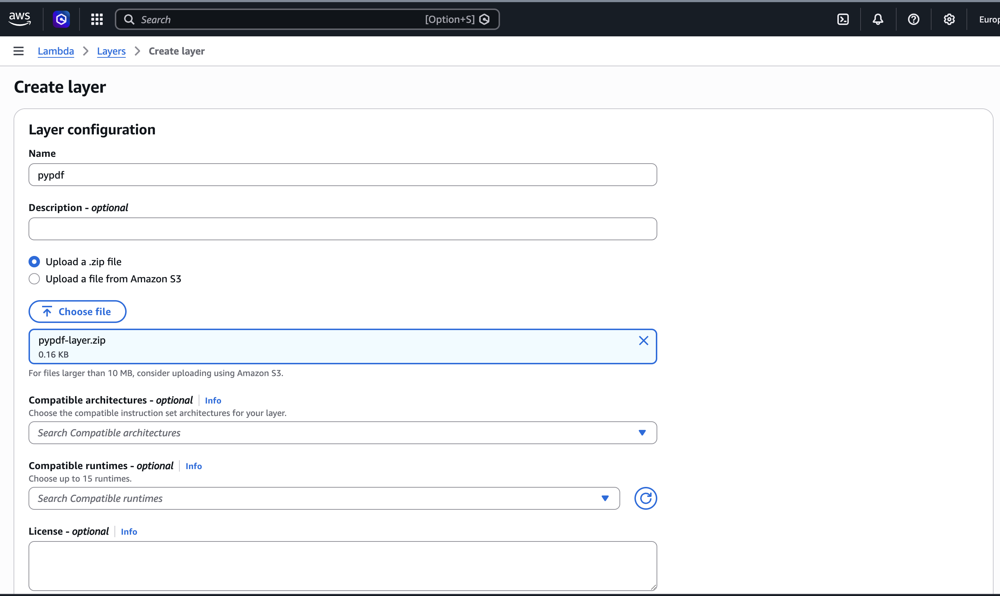

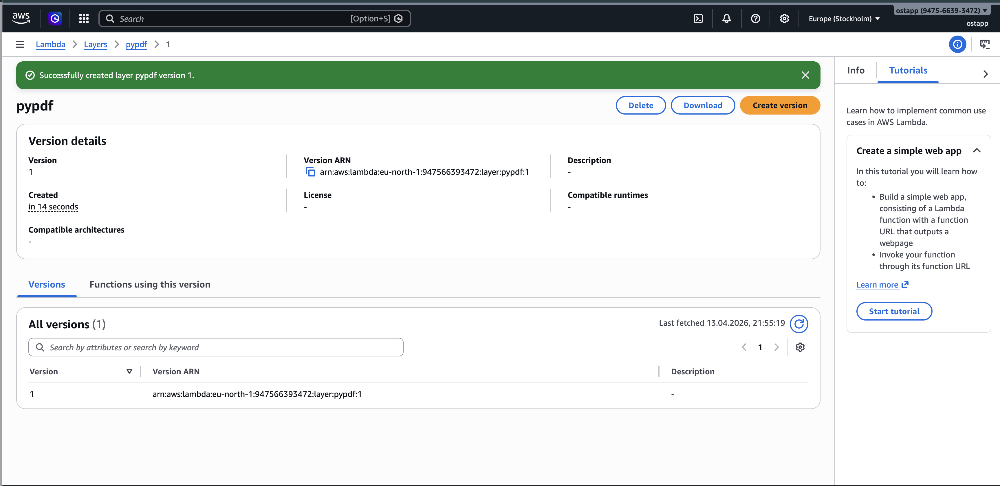

Layer підключено до функції:

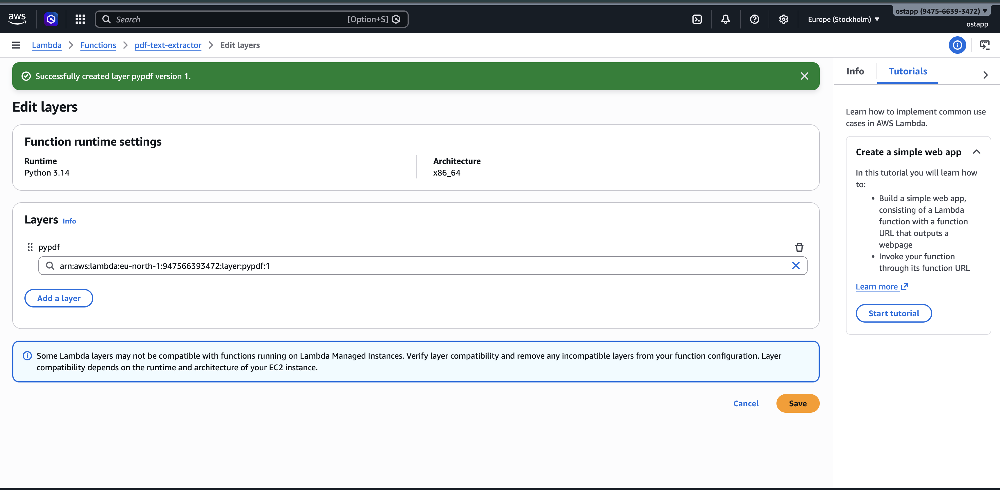

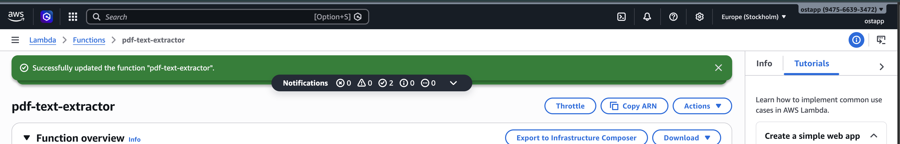

---

### Крок 6: IAM Role

Lambda role `pdf-text-extractor-role-etu40d72` з policies:
- **AmazonS3FullAccess** — читання PDF з S3, запис результату
- **AWSLambdaBasicExecutionRole** — запис логів у CloudWatch
- **AWSLambdaSQSQueueExecutionRole** — читання повідомлень з SQS

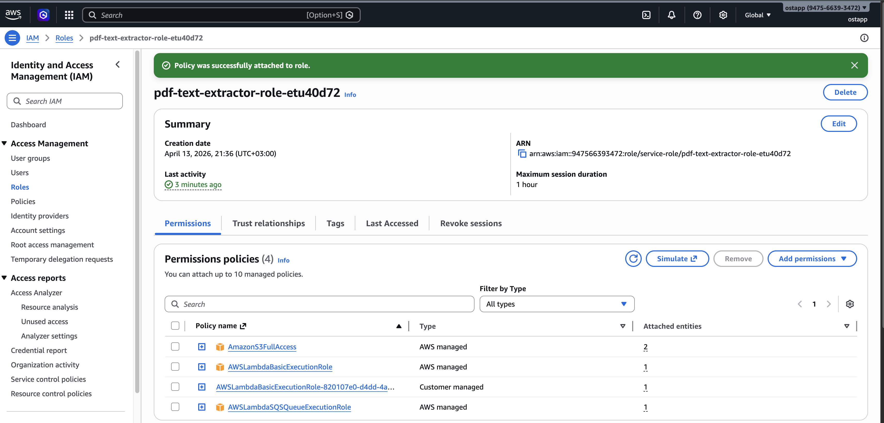

---

### Результат

Lambda успішно викликана, 0 помилок, success rate 100%:

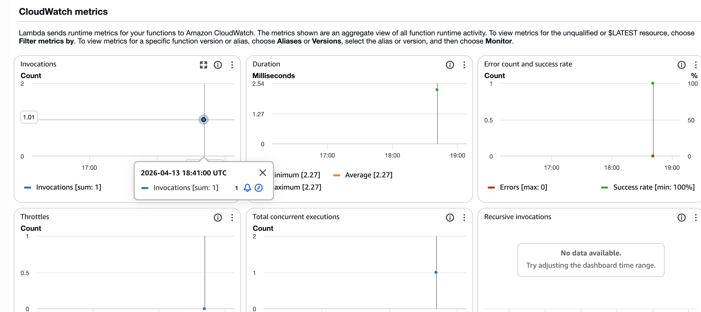

У S3 з'явились обидві папки — `uploads/` та `processed/`:

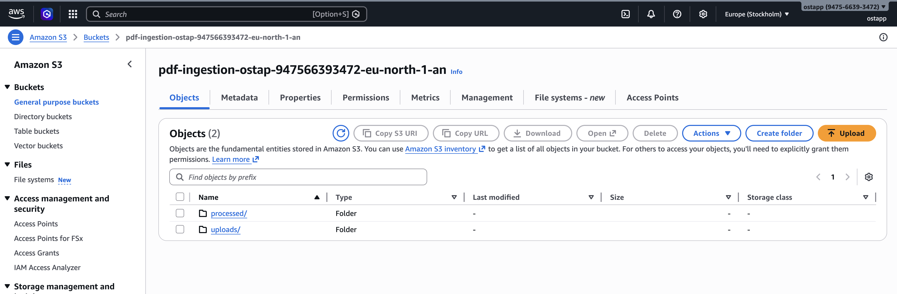

Файл `processed/test3.txt` (705 байт) містить витягнутий текст з PDF:

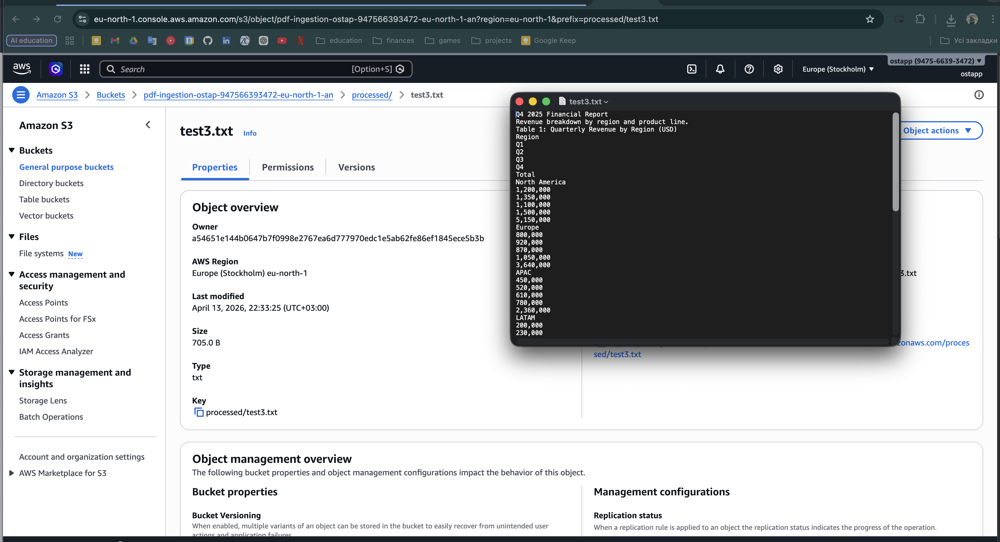

Витягнутий текст містить обидві таблиці з фінансового звіту:
- Table 1: Quarterly Revenue by Region (5 регіонів, 4 квартали)
- Table 2: Revenue by Product Line (4 продукти)

---

### Cleanup

- Всі файли з S3 видалені: `aws s3 rm s3://pdf-ingestion-ostap-947566393472-eu-north-1-an --recursive`
- Budget alert встановлено в AWS Billing

---

## Завдання 3: Самостійне вивчення

### S3 (Simple Storage Service)
Object storage — файли зберігаються як об'єкти в buckets. Кожен об'єкт має key (path), metadata, і сам контент. Підтримує versioning, lifecycle policies (автоматичне переміщення в Glacier), event notifications (тригерять SQS/Lambda при upload). Storage classes: Standard (часте читання), Infrequent Access, Glacier (архівне зберігання).

### SQS (Simple Queue Service)
Message queue для decoupling сервісів. Standard Queue — at-least-once delivery, без гарантії порядку. FIFO Queue — exactly-once, з порядком. Visibility timeout — час протягом якого повідомлення невидиме для інших consumers після отримання (щоб не обробити двічі). Dead Letter Queue — куди потрапляють повідомлення які не вдалось обробити після N спроб.

### Lambda
Serverless compute — код виконується у відповідь на events без управління серверами. Cold start — перший виклик повільніший (завантаження runtime). Layers — спосіб додати зовнішні залежності (pypdf). Ліміти: 15 хв max execution, 10GB RAM, 10GB /tmp. Concurrency — кількість одночасних виконань.

### IAM (Identity and Access Management)
Управління доступами. Users — для людей, Roles — для сервісів (Lambda, EC2). Policy — JSON документ з Effect (Allow/Deny), Action (s3:GetObject), Resource (arn:aws:s3:::bucket/*). Principle of least privilege — кожен сервіс отримує мінімально необхідні дозволи.