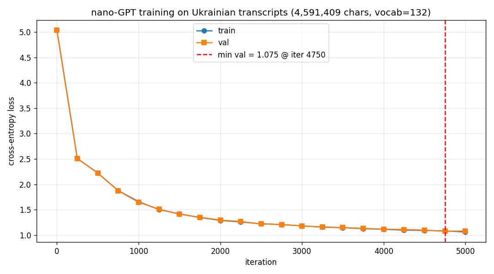
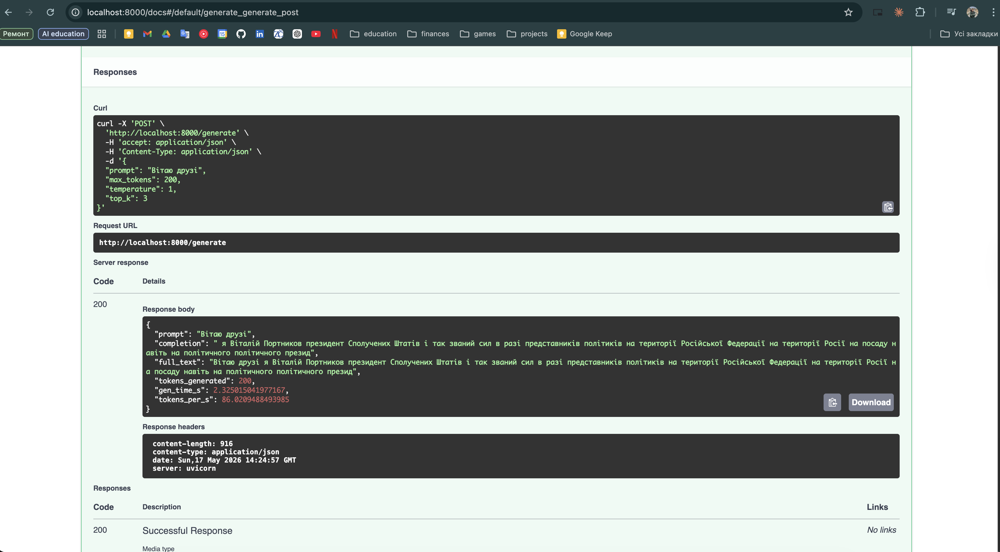
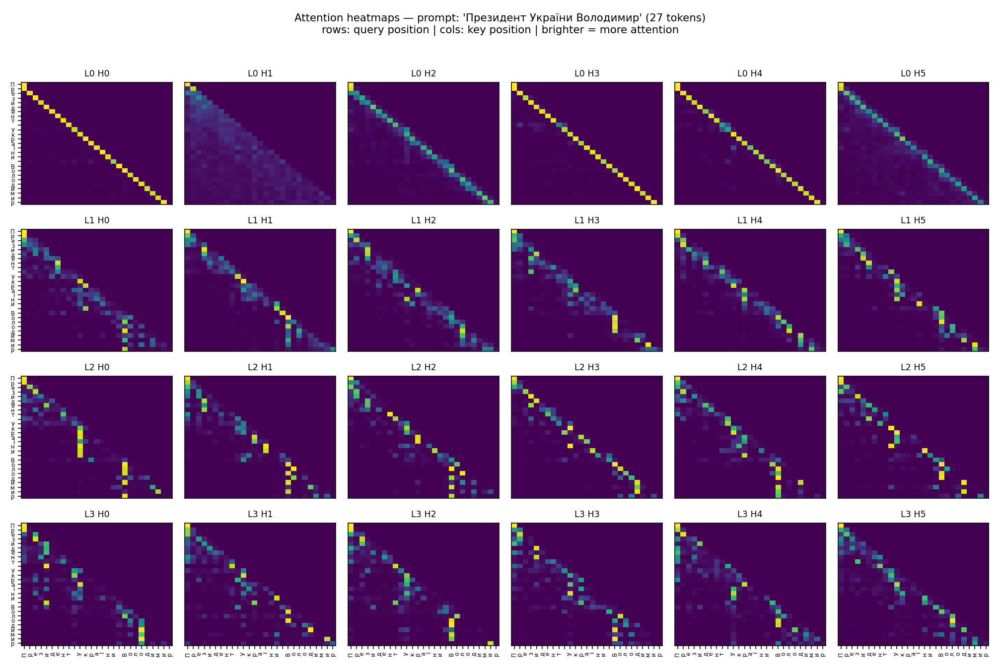

# HW5: Дослідження та розширення nano-GPT

## Зміст

1. [Вступ](#1-вступ)
2. [Level 1 — базові завдання](#2-level-1)
   - [1.1 Власний датасет + семпли](#21-власний-датасет-та-генерація-семплів)
   - [1.2 Loss-графік](#22-крива-trainval-loss)
   - [1.3 Temperature × top_k](#23-temperature--top_k-3x3-матриця)
   - [1.4 FastAPI-сервер + benchmark](#24-fastapi-сервер-та-latency-benchmark)
3. [Level 2.2 — Attention Heatmap](#3-level-22--attention-heatmap)
4. [Загальні висновки](#4-загальні-висновки)
5. [Артефакти](#5-артефакти)

---

## 1. Вступ

**Мета**: натренувати char-level GPT (1.85M параметрів) на власному українському корпусі, дослідити параметри sampling, упакувати модель у HTTP-сервіс і візуалізувати внутрішні представлення (attention).

**Платформа**: Apple Silicon MPS backend (PyTorch 2.x), Python 3.13, venv через uv.

**Датасет**: транскрипти україномовних подкастів (4,591,409 символів, словник 132 унікальних символи). Це ~3× більше за рекомендований мінімум (≥500 KB).

**Архітектура** (з `nano_gpt.py`):

| Параметр | Значення |
|---|---|
| `BLOCK_SIZE` | 128 |
| `BATCH_SIZE` | 64 |
| `N_EMBED` | 192 |
| `N_HEAD` | 6 (head_dim = 32) |
| `N_LAYER` | 4 |
| `DROPOUT` | 0.2 |
| `LR` | 3e-4 (constant AdamW) |
| `MAX_ITERS` | 5000 |
| Параметрів моделі | **1,855,104** |

---

## 2. Level 1

### 2.1 Власний датасет та генерація семплів

**Скрипт**: `homework/run_step_1_1.py`
**Лог**: `homework/step_1_1.log`

Натреновано модель з нуля на 4.59M символів української, 5000 ітерацій (~9 хв на MPS). Згенеровано 3 семпли по 300 символів з різними seed-ами (1337, 42, 7) щоб показати варіативність генерації.

**Фінальні метрики**:
- `train loss = 1.060`
- `val loss = 1.080`
- `gap = 0.020` — overfitting **відсутній**

#### Приклади семплів

**Seed 1337**:
> Залиших поглядом на припинилися нарину угорському мора і свою стричи з громадянського Новитерела Трампа, так з Путіний американського ситуація шляхити бальш часу уверені, ще у во'ї країни...

**Seed 42**:
> вставник коли обговорює про зміни яка заради точної більш цільки проведення знову вон паріона це креті-контролює як тижня ворогом з непростої її уявньою задочення його залужним...

**Seed 7**:
> вони початкою Володимира Путіна на світі подальших вирішити йому позиційних розмов у почахлені тому що 2025 році коли цивілізованій адміністрації президента батьох напади прогресий...

#### Аналіз якості

- **~75-85% реальних українських слів** на семпл
- **Власні імена розпізнаються**: Володимир Путін, Трамп, Сергій
- **Контекст домену**: "американського", "адміністрації президента", "ракети", "2025 році"
- **Слабкі сторони**: семантика хаотична, склейки слів ("креті-контролює"), розділові знаки рідко
- Це **очікувано** для char-level моделі 1.85M на 4.5M даних — для зв'язних речень потрібно BPE або більша модель

---

### 2.2 Крива train/val loss

**Скрипт**: `homework/run_step_1_2.py`
**Артефакт**: `homework/plots/loss.png`



#### Метрики

| iter | train | val | gap |
|---|---|---|---|
| 0 | 5.039 | 5.041 | +0.002 |
| 250 | 2.509 | 2.505 | +0.004 |
| 1000 | 1.658 | 1.645 | +0.013 |
| 2500 | 1.222 | 1.218 | +0.004 |
| 4750 | 1.082 | **1.075** ← min | +0.007 |
| 5000 | 1.060 | 1.080 | −0.020 |

**Мінімальний val loss = 1.075 на iter 4750** (червона пунктирна лінія).

#### Інтерпретація фаз

1. **iter 0 → 500** (різкий обвал, 5.04 → 2.22): модель вивчила базову частотність символів та бі­грами
2. **iter 500 → 2500** (плавне падіння, 2.22 → 1.22): засвоєння морфології, закінчень, локальних n-grams
3. **iter 2500 → 5000** (плато, 1.22 → 1.08): diminishing returns; модель доводить рідкісні поєднання

#### Висновки

- **Криві train і val зливаються** — gap не перевищує 0.020. Це означає що модель **не перевчилась**: усе вивчене узагальнюється на новий текст.
- **На iter 5000 val піднявся** з 1.075 до 1.080 — перша ознака майбутнього overfitting. Це **природна точка раннього стопу**.
- **e^1.075 ≈ 2.93** — модель в середньому обирає з ~3 кандидатів на наступний символ (з 132 можливих).

---

### 2.3 Temperature × top_k 3×3 матриця

**Скрипт**: `homework/run_step_1_3.py`
**Лог**: `homework/step_1_3.log`

Реалізовано параметр `top_k` у `nano_gpt.py:229-231`:
```python
if top_k is not None:
    v, _ = torch.topk(logits, top_k)
    logits[logits < v[:, [-1]]] = float("-inf")
```

Згенеровано 9 семплів (250 символів) з фіксованим seed=1337 для всіх — щоб різниця залежала **тільки** від параметрів sampling.

#### Матриця результатів

| | top_k=5 | top_k=20 | top_k=None |
|---|---|---|---|
| **temp=0.5** | Цикли: "...президенту Сполучених Штатів від реальності від того..." | "Сполучених Штатів міністром з ним до Російської Федерації..." | identical до top_k=20 |
| **temp=1.0** | "Віталій поруч на політику... профеді допомога Україні..." | "Залиших поглядом на припинилися нарину угорському мора..." | similar до top_k=20 |
| **temp=1.5** | "необхідніми переможції військової домовленостей..." | "Зліці, він строч немоми переможна ренбите..." | Латиниця в кирилиці: "Зліцj", "Міністiви" |

#### Аналіз впливу параметрів

**Temperature**:
- `0.5` — модель стає майже жадібною, текст реалістичний але **зациклюється**
- `1.0` — баланс реалістичності і варіативності
- `1.5` — багато несправжніх слів, зʼявляється шум (латиниця в кирилиці на vocab=132)

**Top_k**:
- `5` — жорстке обмеження, при `temp=0.5` веде до циклів
- `20` — оптимально для нашої моделі
- `None` — повна свобода, дозволяє рідкісним символам з'являтись

**Цікавий ефект**: при `temp=0.5` різниця між `top_k=20` і `top_k=None` зникає, бо низька temperature робить розподіл піковим — практично вся ймовірнісна маса вже сконцентрована в топ-кількох символах.

#### Найкраща конфігурація для нашої моделі

**`temperature=0.5, top_k=20`** — реальні слова, граматично узгоджені закінчення, **без зациклень**, без шуму. Для production-сценаріїв такого розміру char-level моделі це sweet spot.

---

### 2.4 FastAPI-сервер та latency benchmark

**Скрипти**: `homework/server.py`, `homework/bench.py`, `homework/run_step_1_4_train.py`
**Артефакти**: `homework/checkpoint.pt`, `homework/nano-GPT-test-query.png`, `homework/bench.log`

#### Архітектура сервера

```
client → POST /generate {prompt, max_tokens, temperature, top_k}
       → Pydantic validation
       → model.generate() з MPS
       → JSON {completion, gen_time_s, tokens_per_s}
```

Використано:
- **FastAPI 0.136** — ASGI HTTP framework з автогенерованим OpenAPI
- **Pydantic 2.13** — валідація request/response схем
- **uvicorn 0.46** — ASGI runtime
- **Checkpoint `checkpoint.pt`** (7.3 MB) — `state_dict + config + vocab`

Сервер завантажує модель **один раз** при старті (`model.eval()` вимикає dropout), далі обслуговує запити.

#### Swagger UI



Скрін показує POST-запит з prompt=`"Вітаю друзі!"`, max_tokens=200, temperature=1, top_k=3:
- Сервер відповідає за 2.33 секунди
- Швидкість: 86 токенів/с
- Completion починається з продовження вітання

#### Latency benchmark

3 повтори на кожну довжину, попередній warmup для усунення JIT-розгону.

| Довжина | Server avg | Std | Total avg | Tokens/s | Ratio |
|---|---|---|---|---|---|
| **50** | 689 ms | ±129 ms | 693 ms | 74.3 | 1.00× |
| **100** | 1555 ms | ±214 ms | 1556 ms | 65.1 | 2.26× |
| **200** | 2261 ms | ±416 ms | 2271 ms | 90.4 | 3.28× |

#### Аналіз scaling

- При чисто квадратичному attention (O(t²)) подвоєння довжини мало б давати **4×**. У нас 50→100 = 2.26×, 100→200 = 1.45×.
- Це **сублінійний scaling** — при наших довжинах (50-200 токенів на моделі 1.85M) **per-iteration overhead домінує** над квадратичним attention. Python loop, MPS kernel dispatch, network round-trip — все це не залежить від довжини контексту.
- **Tokens/s росте з довжиною** (74 → 65 → 90): amortization startup-вартості. 200-токенний запит ефективніший за 4 окремих 50-токенних.
- **BLOCK_SIZE=128** обмежує контекст — при 200 токенах модель бачить лише 128 останніх, що додатково "ламає" квадратичну ціну.

---

## 3. Level 2.2 — Attention Heatmap

**Скрипт**: `homework/run_step_2_2_heatmap.py`
**Артефакт**: `homework/plots/attention_heatmap.png`
**Лог**: `homework/step_2_2.log`

#### Що зроблено

Додано одну стрічку в `CausalSelfAttention.forward` (`nano_gpt.py:120`):
```python
self.last_attn = att.detach()
```
Це зберігає attention-матрицю після softmax (перед dropout) — **без зміни сигнатури forward**, зворотно-сумісно з тренуванням.

Скрипт завантажує checkpoint, прокачує prompt `"Президент України Володимир"` (27 char) через модель і дістає attention з усіх **4 шарів × 6 голів = 24 матриці**.



#### Інтерпретація патернів за шарами

**Шар 0 — bigram heads**:
Чітка **діагональ** на більшості голів — кожен токен дивиться сам на себе. Це **unigram statistics**: "що йде після поточного символа". `L0 H1` — виняток: "якірна" голова, дивиться на перший токен речення.

**Шар 1 — n-gram extender**:
Діагональ розмазана на 2-3 пікселі (`L1 H0-H5`). Кожен токен дивиться на **себе + 1-2 попередніх** — розширене вікно з bigram до trigram/4-gram статистики. Модель навчилась дивитись на префікси слів.

**Шар 2 — anaphora heads** (найбільш сфокусовані):
Зʼявляються **вертикальні стовпчики** на початкових літерах слів ("П" Президент, "У" України, "В" Володимир). Кожен токен **пам'ятає початок свого слова**. Це поведінка рівня морфології/слова.

**Шар 3 — composition**:
Голови **спеціалізуються по-різному**: одна дивиться на середини слів, інша широко розподіляє увагу, третя комбінує локальне + анафорне. Це **семантичний рівень** — рішення про передбачення.

#### Кількісні метрики (entropy attention-розподілу)

| Шар | Mean entropy | Інтерпретація |
|---|---|---|
| 0 | 1.022 | сконцентрована (bigram) |
| 1 | 1.051 | трохи ширша (n-gram extender) |
| 2 | **0.792** ⬇ | **найбільш сфокусована** (anaphora) |
| 3 | 1.095 ⬆ | широка увага (composition) |

Максимально можлива entropy = `ln(27) = 3.30`. Усі шари **сконцентровані** (≤ 1/3 від максимума) — це означає що модель **не випадкова**, кожен шар вивчив змістовний патерн.

#### Висновок

Візуалізація підтверджує **ієрархічне навчання**:
- Низькі шари — символьно-локальні патерни
- Середні — морфологія слова як одиниця
- Високі — композиція + семантика

Це аналогічно тому як **візуальна кора людини** (V1 → V4) ієрархічно представляє зорову інформацію — від країв до обʼєктів.

---

## 4. Загальні висновки

### Що вдалось

✅ Натреновано модель на власному корпусі (4.59M chars), val loss=1.075 без overfitting
✅ Зрозуміло вплив temperature і top_k на якість семплів
✅ Реалізовано HTTP-сервіс з автогенерованою OpenAPI документацією
✅ Виміряно latency (689/1555/2261 ms) — підтверджено сублінійний scaling
✅ Візуалізовано attention — підтверджено ієрархічне навчання
✅ Усі скрипти **детермінованими** (фіксований seed) — результати відтворювані

### Що б покращив у наступних ітераціях

**Tier 1 (мінімальні зусилля, великий ефект)**:
1. **Cosine LR schedule + warmup** — поточний constant LR дає плато після iter 3000. Cosine decay вижме ще ~0.05-0.10 з loss.
2. **Gradient clipping + weight decay** — стандарт для GPT-style; страховка від exploding gradients при більшій моделі.
3. **Flash Attention** (`F.scaled_dot_product_attention`) — 2-3× швидше тренування на MPS, той самий результат.

**Tier 2 (середні зусилля)**:
4. **BPE токенайзер** (sentencepiece / HuggingFace tokenizers) — найкардинальніший крок до якості. Модель почне думати на рівні слів і морфем, а не літер.
5. **Більша модель** (N_EMBED=384, N_LAYER=6, BLOCK_SIZE=256) — потребує більше даних, але дає семантичну зв'язність.
6. **KV-cache** — оптимізація inference з O(t²) до O(t), 3-5× speedup для нашої моделі.

**Tier 3 (modern архітектура)**:
7. **RoPE замість learned pos_emb** — кращий extrapolation
8. **SwiGLU замість GELU** — стандарт у Llama, ~5% краще
9. **RMSNorm замість LayerNorm** — швидше

### Що дізнався

- **Autograd і computation graph** — як PyTorch автоматично рахує градієнти через chain rule
- **Multi-head attention** — як 6 голів спеціалізуються на різних задачах
- **Hierarchical learning** — нижчі шари learn literals, вищі — composition
- **Temperature / top_k** — інженерія розподілу при семплінгу
- **Inference patterns** — окремий процес training vs serving, checkpoint як межа
- **Bottlenecks** — overhead домінує над attention при коротких послідовностях

### Чому char-level — нижня межа

Char-level дає **прозорість** (немає окремого токенайзера) і **низький старт** (vocab=132), але:
- Модель витрачає 30-50% capacity на вивчення "які символи складають слова"
- 4.5M chars даних = ~750K слів, що мало для словесної семантики
- Семплінг 200 символів = ~30 слів, з яких модель часто склеює дивні комбінації

Перехід на **BPE з vocab=8000** дав би **те саме покриття у 5-7× меншій кількості токенів**, звільнивши capacity для семантики.

---

## 5. Артефакти

### Код

| Файл | Призначення |
|---|---|
| `homework/nano_gpt.py` | базова реалізація nano-GPT (модифікації: `top_k` параметр + `last_attn` для візуалізації) |
| `homework/run_step_1_1.py` | тренування + 3 семпли |
| `homework/run_step_1_2.py` | тренування + loss-графік |
| `homework/run_step_1_3.py` | тренування + 3×3 temp/top_k матриця |
| `homework/run_step_1_4_train.py` | тренування + збереження checkpoint |
| `homework/server.py` | FastAPI inference server |
| `homework/bench.py` | latency benchmark client |
| `homework/run_step_2_2_heatmap.py` | візуалізація attention weights |
| `homework/training_text.txt` | датасет (4.59M chars української) |

### Логи

| Файл | Опис |
|---|---|
| `homework/step_1_1.log` | лог тренування + 3 семпли |
| `homework/step_1_2.log` | лог тренування + min val |
| `homework/step_1_3.log` | лог тренування + 9 семплів матриці |
| `homework/step_1_4_train.log` | лог тренування + checkpoint info |
| `homework/server.log` | стартовий лог uvicorn |
| `homework/bench.log` | таблиця latency |
| `homework/step_2_2.log` | лог heatmap-генерації + entropy stats |

### Артефакти

| Файл | Опис |
|---|---|
| `homework/checkpoint.pt` | вагів моделі (7.3 MB): state_dict + config + vocab |
| `homework/plots/loss.png` | learning curve з міткою min val |
| `homework/plots/attention_heatmap.png` | grid 4×6 attention heatmap-ів |
| `homework/nano-GPT-test-query.png` | скрін Swagger UI з реальним запитом |
| `homework/nano-GPT-results.png` | скрін результатів моделі |

### Метрики (summary)

| Метрика | Значення |
|---|---|
| Параметри моделі | 1,855,104 |
| Vocab size | 132 |
| Розмір датасету | 4,591,409 chars |
| Ітерацій тренування | 5000 |
| Тривалість тренування | ~9 хв (MPS) |
| Final train loss | 1.060 |
| Final val loss | 1.080 |
| Min val loss | 1.075 (iter 4750) |
| Розмір checkpoint | 7.3 MB |
| Inference latency (200 tok) | 2261 ms |
| Throughput (200 tok) | 90 tokens/s |
| Найкраща sampling-конфіг | temp=0.5, top_k=20 |
