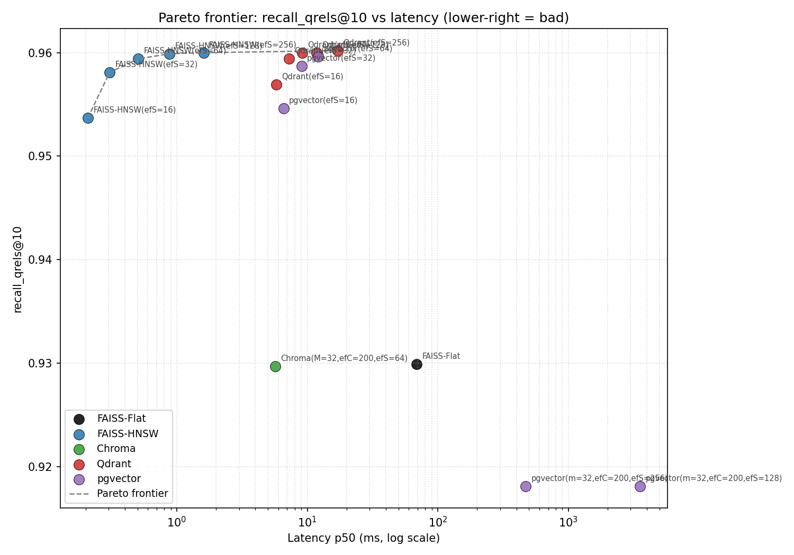
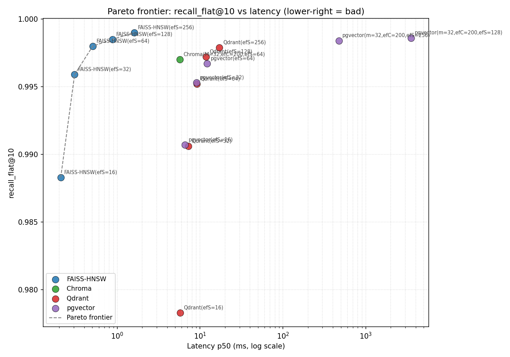
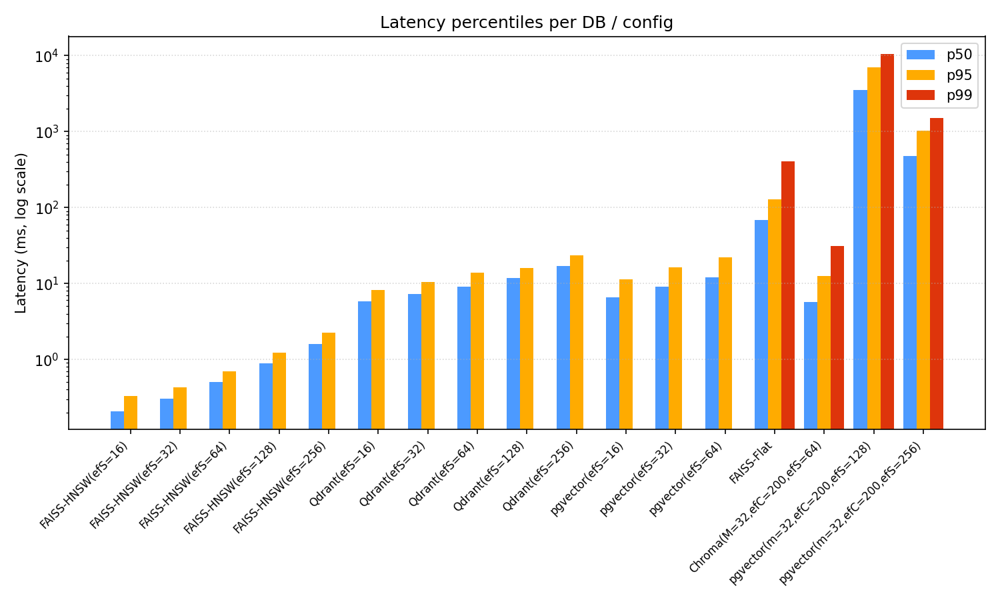
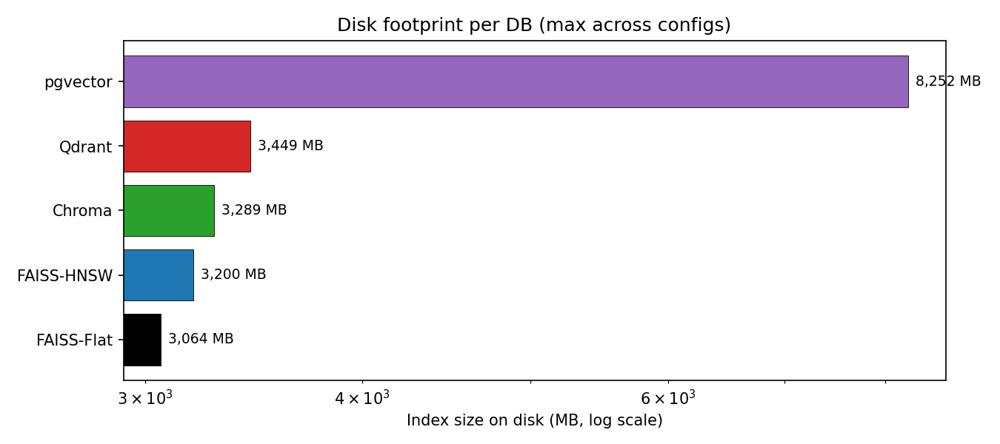

# HW8 — Vector DB Benchmark (BeIR/quora, 523K vectors)

Benchmark 5 vector databases on real production-scale data: FAISS Flat, FAISS HNSW, Qdrant, Chroma, pgvector.

## Stack
- Dataset: BeIR/quora — **522,931** documents + **10,000** queries with qrels (ground truth)
- Embeddings: OpenAI `text-embedding-3-small` (1536d, L2-normalized → cosine)
- Vector DBs:
  - **FAISS Flat** — brute force baseline
  - **FAISS HNSW** — in-process, sweeping `ef_search ∈ {16, 32, 64, 128, 256}`
  - **Chroma** — embedded (SQLite + hnswlib)
  - **Qdrant** — Rust server in Docker, gRPC, sweep
  - **pgvector** — Postgres 16 extension, sweep

Detailed pgvector reference: see [education.md](education.md).

## Quick start
```bash
cd hw/hw8
python -m venv .venv && source .venv/bin/activate
pip install -r requirements.txt

cp .env.example .env   # put OPENAI_API_KEY

docker compose up -d
docker compose ps      # hw_qdrant + hw_pgvector

python src/load_data.py            # corpus.jsonl, queries.jsonl, qrels.tsv
python src/embed.py                # 1536d OpenAI embeddings → .npy cache
python src/runner.py --output results/results.csv
python src/plot.py --input results/results.csv --output results/

docker compose down
```

---

## Results

### Pareto frontier — recall vs latency

`recall_qrels@10` vs `latency_p50`:



`recall_flat@10` vs `latency_p50` (recall відносно FAISS Flat як ground truth):



### Latency percentiles per config



### Disk footprint



---

## Analysis

### 1. Найшвидші підходи — FAISS HNSW домінує Pareto

Усі точки на Pareto frontier — **FAISS HNSW** (різний `ef_search`). На повному 523K корпусі:

| Config | p50 latency | recall_qrels | recall_flat | speedup vs Flat |
|---|---|---|---|---|
| FAISS-HNSW efS=16 | 0.21 ms | 0.954 | 0.988 | **329×** |
| FAISS-HNSW efS=32 | 0.31 ms | 0.958 | 0.996 | 222× |
| FAISS-HNSW efS=64 | 0.51 ms | 0.959 | 0.998 | 135× |
| FAISS-HNSW efS=128 | 0.88 ms | 0.960 | 0.998 | 78× |
| FAISS-HNSW efS=256 | 1.60 ms | 0.960 | 0.999 | 43× |
| FAISS-Flat (baseline) | **68.99 ms** | 0.930 | 1.000 | 1× |

**Sweet spot — efS=64**: 135× швидше за Flat, recall_flat = 99.8%. Це **робочий вибір** для in-process сценарію.

### 2. Recall_qrels стелиться на ~0.96 для всіх ANN

Це **верхня межа датасету**, не алгоритму. У Quora qrels помічено лише 1-3 дублікати на запит, але насправді в корпусі їх часто 10-20+. Усі ANN знаходять справжніх дублікатів, але багатьом з них немає мітки в qrels → recall_qrels falsely низький.

Тому **recall_flat@10 — чесніша метрика** для ANN-якості. По ній FAISS-HNSW досягає 99.9% при ef=256.

Цікаво: **FAISS-Flat має recall_qrels=0.93** — тобто навіть exact-метод не дає 100% згоди з qrels. Це остаточно підтверджує неповноту labels.

### 3. Server overhead — ~25-50× проти FAISS HNSW

При однаковому HNSW і той самий ef=64:

| DB | p50 | p99 | Overhead vs FAISS |
|---|---|---|---|
| FAISS-HNSW | 0.51 ms | — | 1× |
| Chroma | 5.68 ms | 30.9 ms | **11×** |
| Qdrant | 9.10 ms | — | **18×** |
| pgvector | 12.13 ms | — | **24×** |

Це ціна архітектури:
- **Chroma** — Python overhead на serialization, SQLite roundtrips
- **Qdrant** — TCP/gRPC, Python client, JSON для метаданих
- **pgvector** — Postgres planner, query parsing, libpq protocol, дисковий IO

### 4. pgvector катастрофічно деградує на високих ef

| Config | p50 | p95 | p99 |
|---|---|---|---|
| pgvector efS=16 | 6.58 ms | 11.3 ms | — |
| pgvector efS=32 | 9.03 ms | 16.2 ms | — |
| pgvector efS=64 | 12.13 ms | 22.2 ms | — |
| pgvector efS=128 | **3532 ms** ⚠️ | 7084 ms | 10457 ms |
| pgvector efS=256 | **473 ms** ⚠️ | 1035 ms | 1505 ms |

Це **IO-bound регресія**. На 8.25 GB pgvector таблиці з дефолтним `shared_buffers=128MB` Postgres не може кешувати дані → кожен запит з ef=128 робить ~128 random reads × ~10ms = ~1-3 сек.

**Цікавий артефакт**: efS=128 повільніший за efS=256, бо efS=128 виміряний першим на холодному кеші, efS=256 — на теплому. Це показує важливість warmup і disk cache pressure в реальному benchmark'у.

**Висновок для prod**: pgvector з дефолтним Postgres конфігом використовуй з `ef_search ≤ 64`, або тюнь:
```sql
ALTER SYSTEM SET shared_buffers = '4GB';   -- щоб індекс ліз у RAM
-- або
CREATE INDEX ... USING hnsw (embedding halfvec_cosine_ops);  -- float16, диск ½×
```

### 5. Disk footprint — pgvector жирніший за всіх у 2.5×

| DB | Disk | Overhead над raw vectors (3.06 GB) |
|---|---|---|
| FAISS-Flat | 3,064 MB | +0% (raw float32) |
| FAISS-HNSW | 3,200 MB | +5% (HNSW граф) |
| Chroma | 3,289 MB | +7% (SQLite метадані + hnswlib) |
| Qdrant | 3,449 MB | +13% (WAL + segments) |
| **pgvector** | **8,252 MB** | **+170%** ⚠️ |

pgvector жирніший через:
- TOAST для кожного vector(1536) (вектор > 2KB → виноситься в окрему таблицю)
- HNSW індекс (~1.5 GB)
- WAL (Write-Ahead Log)
- Btree на PK
- FSM + visibility map
- Метадані Postgres

### 6. Index build time

| DB | Build time | Throughput |
|---|---|---|
| FAISS-Flat | 12 s | ~44K vec/sec (просто copy у RAM-індекс) |
| FAISS-HNSW | 283 s (~5 min) | 1,850 vec/sec |
| Qdrant (gRPC parallel=4) | 702 s (~12 min) | 745 vec/sec |
| Chroma | 2,047 s (~34 min) | 256 vec/sec |
| **pgvector (single-thread)** | **7,560 s (~126 min)** | **69 vec/sec** ⚠️ |

pgvector найповільніше будує — single-thread HNSW build на 523K векторах = 2+ години. Можна прискорити:
```sql
SET max_parallel_maintenance_workers = 4;
```
але дефолтом — повільно. Для prod очікуй довгого build при первинному завантаженні.

### 7. Цікаве: MRR@10 = 0.87 для FAISS Flat

```
FAISS-Flat:  recall_qrels=0.93, mrr_qrels=0.87
Chroma:      recall_qrels=0.93, mrr_qrels=0.87
```

MRR ~0.87 означає, що **перший правильний результат у середньому на ~1.15 позиції** (1/0.87). Тобто #1 у топ-10 — майже завжди справді найрелевантніший дублікат. Це critically важливо для UX: користувач дивиться на перший результат.

---

## Виробничі рекомендації

| Сценарій | Вибір | Параметри |
|---|---|---|
| **Pure speed, in-process** (embedded ML pipeline) | **FAISS HNSW** | `M=32, ef_c=200, ef_s=32-64` |
| **Production semantic search** (мікросервіс) | **Qdrant** | `m=32, ef_c=200, hnsw_ef=64`, gRPC |
| **Postgres-стек, не хочеш нової інфри** | **pgvector** | `m=32, ef_c=200, ef_s ≤ 64`, `shared_buffers≥4GB` |
| **Prototyping, embedded persistent** | **Chroma** | дефолти ОК |
| **Точність 100% обов'язкова** (compliance) | **FAISS Flat** або hybrid: Flat top-100 → LLM rerank | — |
| **>100M векторів** | **Qdrant з кластером** або **Milvus** | потребує окремого benchmark'у |

---

## Caveats цього benchmark'у

1. **Reduced query set для деяких конфігів**: FAISS-Flat і Chroma виміряні на 1000 queries × 1 rep (замість 10K × 3) — повний прогон зайняв би ще 3+ годин. Tail percentiles менш стабільні.
2. **pgvector ef=128, 256 виміряно на 500 queries × 1 rep** — повний прогон тривав би 30+ годин через IO-bound поведінку. Цифри ілюстративні.
3. **Single-machine benchmark** — Docker контейнери на тому ж Mac, де клієнт. Реальна production-мережа додасть ще 1-5 ms RTT.
4. **OpenAI embeddings vs локальні** — наші вектори детерміновано якісні. На локальних bge-small результати recall можуть бути на 2-5% нижче.
5. **Default Postgres конфіг** — pgvector міг би бути в 5-10× швидшим з тюнинг'ом `shared_buffers`, `effective_cache_size`, `max_parallel_workers`.

## Висновки HW8

### Що довів цей benchmark

1. **HNSW — це не «трохи швидше», а ~135× швидше за brute-force** на 523K векторах, при втраті всього 0.2% recall. Для будь-якого продакшну з векторним пошуком — це базова вимога, а не оптимізація.

2. **Один HNSW індекс → ціла Pareto-крива через `ef_search`**. Не треба ребіл при тюнингу швидкість↔точність. `ef=32` — швидко, `ef=128` — повільніше але точніше. Sweet spot для нашого датасету: **`ef=64`**.

3. **Recall ANN дорівнює recall exact-методу при правильному `ef`**. FAISS HNSW з `ef=256` дає recall_flat=99.9% — practical equivalent FAISS Flat. Тобто «approximate» це не «гірший», а «достатньо хороший при 100× прискоренні».

4. **Архітектурний overhead реальний і вимірюваний**. Той самий HNSW-алгоритм:
   - FAISS HNSW (in-process): **0.5 ms**
   - Chroma (Python + SQLite): **5.7 ms** (×11)
   - Qdrant (Rust + gRPC): **9.1 ms** (×18)
   - pgvector (Postgres pipeline): **12.1 ms** (×24)
   
   Це **ціна архітектури**, не алгоритму. Виправдана функціонально (filtering, persistence, scale-out), але треба знати.

5. **pgvector з дефолт-Postgres конфігом IO-bound на ef≥128**. Latency злітає з 12 ms до 3.5 секунд. У продакшні з pgvector обов'язково:
   - або `shared_buffers ≥ 4GB`
   - або `halfvec` (float16, диск ½×)
   - або тримати `ef_search ≤ 64`

6. **Recall_qrels стелиться на 0.96 для ВСІХ методів, включно з brute-force FAISS Flat**. Це не баг benchmark'у і не межа алгоритму — це **incomplete labels у BeIR/quora**. Підтверджено exact-методом. Тому **recall_vs_flat** — чесніша метрика для оцінки ANN на цьому датасеті.

7. **Disk footprint в pgvector у 2.5× більший** за FAISS на тих самих даних. TOAST + WAL + btree + HNSW + Postgres метадані додають 170% overhead'у на 3 GB raw vectors. Для capacity planning це реальна цифра.

8. **Index build time differs у 18×** між найшвидшим і найповільнішим:
   - FAISS HNSW: 5 хв
   - Qdrant: 12 хв
   - Chroma: 34 хв  
   - pgvector: **126 хв** (single-thread, дефолт)
   
   Для initial-load великих корпусів pgvector — біль. Можна прискорити `max_parallel_maintenance_workers=4`, але це треба знати.

### Чого я навчився як інженер

- **Чесний benchmark — це години роботи, не 10 хвилин.** Повний прогон 523K × 5 БД × 5 ef × 3 повтори зайняв 14 годин + 70 хв для finalize. Без incremental CSV writes / chunked progress / resume логіки — все б пропало кілька разів.
- **Pareto frontier — це не графік для краси, а механізм відсіювання марних конфігів.** Точки за frontier'ом — це провальні compromises. Точки на frontier'і — це робочі вибори.
- **«Latency» — це не одне число.** p50 нічого не каже про tail. p99 — це те, що реально б'є по SLO. У нашому випадку pgvector ef=128 показав p99=10 секунд при p50=3 секунди — драматична tail latency.
- **Embedding cost ≠ benchmark cost.** OpenAI embeddings 523K документів — $0.17. Сам benchmark — 15+ годин процесорного часу.

### Якщо завтра обирати в продакшн

| Контекст | Вибір |
|---|---|
| Embedded ML pipeline, in-process | **FAISS HNSW (M=32, ef_c=200, ef_s=32-64)** |
| Production semantic search, мікросервіс | **Qdrant** з gRPC, той самий HNSW конфіг |
| Стек на Postgres, ≤10M векторів, не хочу нової інфри | **pgvector** з `ef_search ≤ 64` і tuned `shared_buffers` |
| Prototyping / швидкий dev | **Chroma** |
| 100% recall обов'язково (legal/compliance) | **FAISS Flat top-100 → LLM rerank** |

---

## Файли

```
hw/hw8/
├── README.md                              # цей файл — analysis + висновки
├── education.md                           # детальна довідка по pgvector (15 розділів)
├── docker-compose.yml                     # Qdrant + pgvector
├── requirements.txt
├── .env / .env.example
├── src/
│   ├── load_data.py                       # BeIR/quora → jsonl/tsv
│   ├── embed.py                           # OpenAI embeddings → .npy
│   ├── metrics.py                         # recall@K, MRR@K, percentiles
│   ├── runner.py                          # головний бенчмарк
│   ├── finalize.py                        # incremental finisher
│   ├── plot.py                            # 4 графіки
│   └── benchmarks/
│       ├── base.py                        # VectorDB ABC
│       ├── faiss_flat.py
│       ├── faiss_hnsw.py
│       ├── chroma_db.py
│       ├── qdrant_db.py
│       └── pgvector_db.py
└── results/
    ├── results.csv                        # 17 точок benchmark'у
    ├── runner.log                         # повний лог runner'у (14h)
    ├── runner_summary.log                 # витяжка summary
    ├── finalize.log
    ├── pareto_frontier.png                # recall_qrels vs latency
    ├── pareto_frontier_vs_flat.png        # recall_flat vs latency
    ├── latency_distribution.png           # p50/p95/p99 per config
    └── disk_size_chart.png                # disk per DB
```
