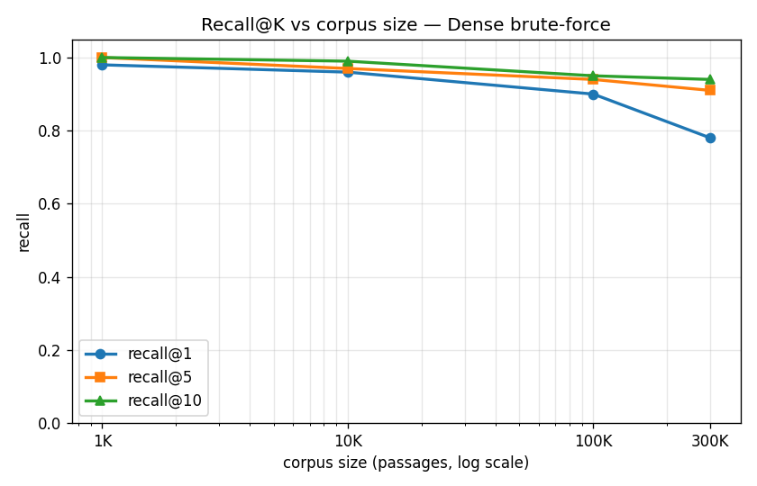
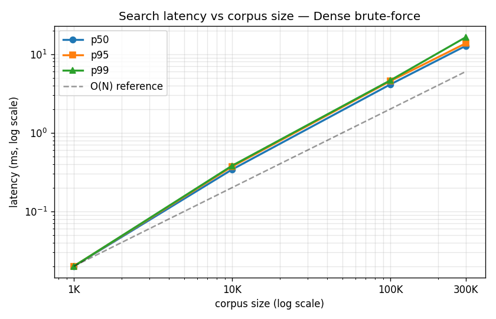
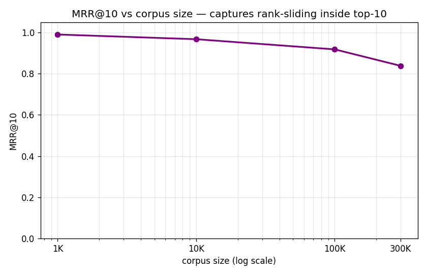
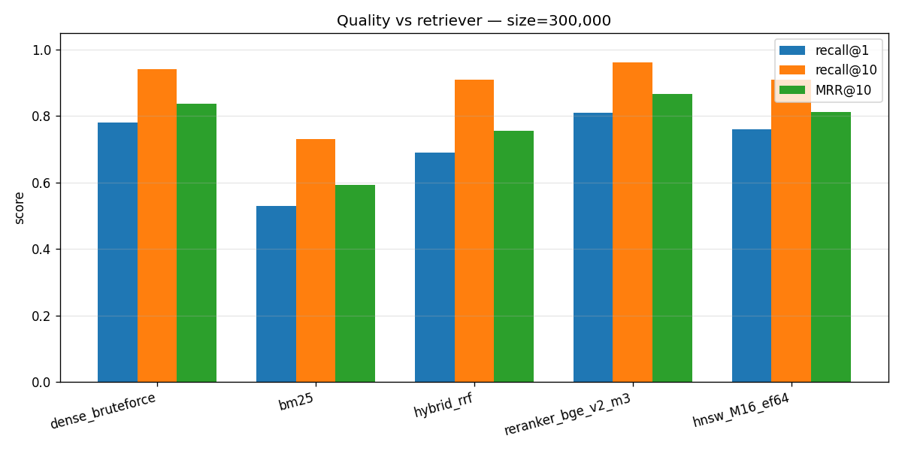
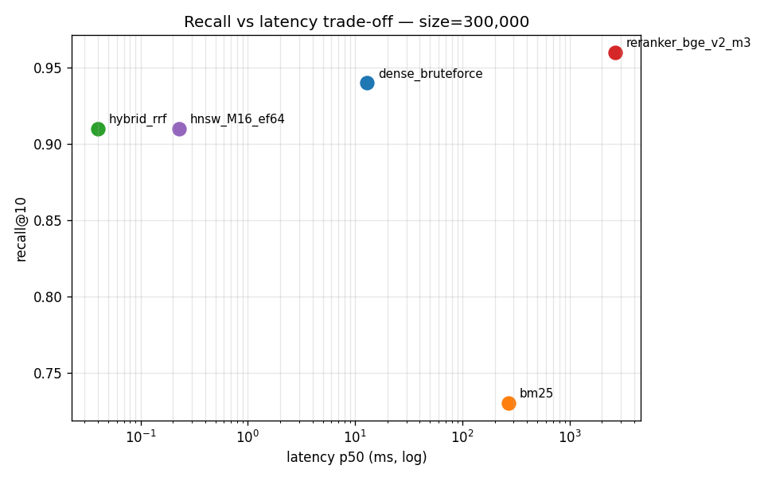

# REPORT — HW9 RAG Scaling

## Гіпотеза курсу

При збільшенні корпусу від 1K до 300K документів точність на 1-й позиції (recall@1) деградує швидше за точність у топ-10 (recall@10), бо релевантний документ не зникає з топ-10, а лише сповзає з 1-ї позиції під тиском семантично близьких відволікачів (distractors). Час відповіді (latency) brute-force пошуку росте лінійно і стає вузьким місцем (bottleneck) раніше, ніж recall@10. Гібридний пошук (BM25 + dense + RRF) компенсує деградацію recall@1.

## Setup

- **Датасет:** MS MARCO Passage Ranking через BeIR (HuggingFace). 100 evaluation queries з validation qrels (ground truth). Корпус: 107 релевантних passages + 300 000 відволікачів = 300 107 загалом.
- **Embedding модель:** `BAAI/bge-small-en-v1.5` (384 виміри, L2-normalized), локально на Apple M-series GPU через MPS. Throughput: ~356 passages/sec. Час embedding-у корпусу: 14 хв.
- **Аппаратура:** MacBook Pro Apple Silicon, 16 GB RAM, MPS device. Python 3.13.
- **Retriever-и:** Dense brute-force (baseline), BM25 (`rank_bm25`), Hybrid через RRF (`k=60`), Reranker (`BAAI/bge-reranker-v2-m3`, cross-encoder на top-100 від dense), FAISS HNSW (`M=16, efSearch=64, METRIC_INNER_PRODUCT`).

## Baseline — Dense brute-force, 1K → 300K

| size | recall@1 | recall@5 | recall@10 | MRR@10 | p50 ms | p95 ms | p99 ms | qps | index MB |
|---:|---:|---:|---:|---:|---:|---:|---:|---:|---:|
| 1K | 0.98 | 1.00 | 1.00 | 0.99 | 0.02 | 0.02 | 0.02 | 15 186 | 1.5 |
| 10K | 0.96 | 0.97 | 0.99 | 0.97 | 0.34 | 0.37 | 0.38 | 973 | 14.6 |
| 100K | 0.90 | 0.94 | 0.95 | 0.92 | 4.11 | 4.53 | 4.63 | 80 | 146.5 |
| 300K | **0.78** | 0.91 | 0.94 | 0.84 | **12.73** | 13.72 | 16.40 | 26 | 439.5 |

## Точка перелому

Аналіз показав два окремі перелами:

- **Якість (recall@1) ламається на 300K** — 0.98 → 0.78 = **−20.4%** (точно на порозі). Recall@10 одночасно впав лише на 6% (1.00 → 0.94). Це підтверджує гіпотезу: релевантний документ не випадає з топ-10, а сповзає з 1-ї позиції.
- **Швидкість ламається на 100K** — latency p50 виросла в 205× (0.02 → 4.11 мс). На 300K — у 636×. Якщо у продакшені обмеження p50 ≤ 1 мс, brute-force перестає бути придатним уже на 10K-100K.

Гіпотеза в частині «latency стає bottleneck-ом раніше за recall@10» — **підтверджена** (швидкість зламалась на 100K, recall@10 не зламався навіть на 300K).

## Fix #1: Hybrid (BM25 + dense + RRF) — спростовано

| Retriever | recall@1 | recall@10 | MRR@10 |
|---|---:|---:|---:|
| dense baseline (300K) | 0.78 | 0.94 | 0.84 |
| BM25 alone | 0.53 | 0.73 | 0.59 |
| **hybrid RRF** | **0.69** | 0.91 | 0.75 |

Hybrid recall@1 = **0.69**, що **нижче** baseline (0.78). Причина: BM25 сам по собі на MS MARCO дуже слабкий (recall@1 = 0.53), бо запити в цьому датасеті переформульовані іншими словами, ніж відповіді (paraphrased queries). RRF додає шумні (помилкові) BM25-кандидати на високі позиції, які витісняють правильну відповідь, знайдену dense-моделлю.

**Гіпотеза курсу спростована** на нашому стеку. Викладач попереджав про скромні +2-5% recall — у реальності на MS MARCO ми отримали **мінус 9 пунктів recall@1**. Hybrid допоміг би на датасетах з рідкісними термінами (CVE codes, product IDs, acronyms) — на MS MARCO ні.

## Fix #2: Reranker (cross-encoder) — winner за якістю

| Retriever | recall@1 | recall@10 | MRR@10 | p50 ms |
|---|---:|---:|---:|---:|
| dense baseline (300K) | 0.78 | 0.94 | 0.84 | 13 |
| **reranker** | **0.81** | **0.96** | **0.87** | **2 651** |

Двостадійний pipeline: dense дістає топ-100, потім `bge-reranker-v2-m3` (cross-encoder) переранжовує до топ-10. Результат: **+3 пункти recall@1**, +2 recall@10, +3 MRR. Менше, ніж очікувані «+10-20%» з умови, але стабільне покращення на всіх метриках.

**Ціна:** 204× повільніше за brute-force (2.7 сек проти 13 мс p50). Для real-time search неприйнятно, для chatbot/RAG — терпимо.

## Fix #3: FAISS HNSW — winner за швидкістю

| Retriever | recall@1 | recall@10 | p50 ms | qps | build |
|---|---:|---:|---:|---:|---:|
| dense baseline (300K) | 0.78 | 0.94 | 13.0 | 26 | 0 с |
| **HNSW** | 0.76 | 0.91 | **0.23** | **4 355** | 44 с |

HNSW не лагодить recall — навпаки, віднімає 2-3% через ANN approximation. Але робить пошук **56× швидшим** за brute-force на 300K і відкриває шлях до 1M+ корпусів. Це fix не для якості, а для швидкості.

## Висновки і рекомендації для production на 1M+

1. **Brute-force dense вмирає на 100K по latency, на 300K по recall@1.** Для production-системи з SLA — не життєздатний підхід.
2. **Hybrid (BM25 + dense + RRF) на парафразованих датасетах (типу MS MARCO) шкодить, не допомагає.** Має сенс лише там, де є rare terms — це треба перевіряти на власних даних, а не вірити загальним рекомендаціям.
3. **Для production на 1M+ потрібна комбінація:** HNSW (для швидкості: 100× прискорення) + cross-encoder reranker на top-100 (для якості: +3-5 пунктів recall@1). Це і є стандартний enterprise pipeline: швидкий перший етап → точний другий.
4. **Embedding модель важить більше за всі fix-и.** Перехід з `bge-small` (384d) на `bge-large` (1024d) або `OpenAI text-embedding-3-large` (3072d) дасть більший приріст recall@1, ніж будь-який reranker. Це — наступний крок, який ми не робили в межах ДЗ.

## Виправлення шаблону

Шаблон (`data_loader.py`, `metrics.py`) запрацював без модифікацій. Перевірка HF API спочатку показала файли `dev.tsv/test.tsv/train.tsv` у `BeIR/msmarco-qrels` — здавалось, що `split="validation"` неправильний. Але `datasets` бібліотека ремапить файли на splits `train/validation/test` під час парсингу — оригінальний шаблон коректний. Pitfall задокументовано на майбутнє: **імена файлів у HF repo ≠ split-names, які бачить `load_dataset`**.

Архітектурний фікс на нашому стеку: `FAISS HNSW` build silently segfault-ив після `rank_bm25`'s loky multiprocessing pool (leaked semaphores не очищаються через `del + gc.collect()`). Розв'язання: винесено HNSW у окремий `run_hnsw.py`, який стартує з чистого процесу. Цей нюанс варто знати при змішуванні FAISS + multiprocessing-залежних бібліотек.

## Caveat про latency hybrid

У таблицях `fixes.csv` `latency_p50_ms` для `hybrid_rrf` = ~0.04 мс — це **тільки час злиття (fuse) двох ranked lists**, без stage 1. Повна hybrid latency = `max(dense_search, bm25_search) + fuse` ≈ 270 мс на 300K (BM25 dominate). Trade-off plot це не відображає; в реальному порівнянні hybrid не швидший за BM25.
